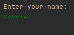

# Tim Buchalka's Java Programming Masterclass for Software Developers

## A repository aimed to store code generated from [the course](https://www.udemy.com/course/java-the-complete-java-developer-course/).

## Table of contents
- [Some concepts](#some-concepts)
    - [Variables](#variables)
    - [Constants](#constants)
    - [Java packages](#java-packages)
    - [Indentation and whitespace](#indentation-and-whitespace)
    - [Scope](#scope)
    - [Class files](#class-files)
- [Primitive types](#primitive-types)
    - [Integer](#integer)
    - [Byte](#byte)
    - [Short](#short)
    - [Long](#long)
    - [Float](#float)
    - [Double](#double)
    - [Char](#char)
    - [Boolean](#boolean)
    - [Casting in Java](#casting-in-java)
- [String](#string)
    - [Parsing values from a string](#parsing-values-from-a-string)
    - [Reading user input](#reading-user-input)
- [Operators, operands, and expressions](#operators,-operands,-and-expressions)
    - [Abbreviating operators](#abbreviating-operators)
    - [Logical AND operator](#logical-and-operator)
    - [Logical OR operator](#logical-or-operator)
- [If-else statement](#if-statement)
    - [If-then](#if-then)
    - [If-else](#if-else)
    - [Ternary operator](#ternary-operator)
- [Methods](#methods)
    - [Creating a method](#creating-a-method)
    - [Executing a method](#executing-a-method)
    - [Parameters](#parameters)
    - [Returning data from a method](#returning-data-from-a-method)
    - [Method overloading](#method-overloading)
- [Control flow statements](#control-flow-statements)
    - [Switch statement](#switch-statement)
    - [For statement](#for-statement)
    - [While statement](#while-statement)
    - [Do-while statement](#do-while-statement)
    - [Continue keyword](#continue-keyword)
## Some concepts

Only a brief explanation on the elements used to create a "hello, world" in Java. They'll be better covered later on.

**Methods** are a collection of statements that perform an operation, like a function. They take in parameters and usually return a value.

Methods that don't return any information are void methods. We use the keyword "void" to define them.

The "main" is an special method that Java looks for when running a program. It's the entry point of any Java code. It's also a void method.

**Classes** are collections of methods that have similar functionalities.

**Modifiers** allows us to define the scope of a part of a code.

It defines wether other code can access ours.

An example:
```
public class Hello {
    public static void main(String[] args) {
        System.out.println("Hello, world.");
    }
}
```

When we run this class, an IDE, in my case IntelliJ, runs this Java command on the background to compile the code:
```
/usr/lib/jvm/java-11-amazon-corretto/bin/java -javaagent:/snap/intellij-idea-community/273/lib/idea_rt.jar=33897:/snap/intellij-idea-community/273/bin -Dfile.encoding=UTF-8 -classpath /home/gagibran/Repositories/Courses
```
Which outputs:
```
Process finished with exit code 0
```
If nothing goes wrong.

Java's print out statement is **System.out.println()**, which prints data and jumps a line.

We also have **System.out.print()**, which prints data without jumping a line.

All java lines **MUST** end with a semi-colon.

**Static, void, and String[] args will be discussed in detail later on.**

Additionally, [here's a cool guide](https://google.github.io/styleguide/javaguide.html) from Google on how to style a Java code.

### Variables

They store a value and allocate it in the RAM.

There are a lot of data types that can be stored in a variable, like integers, booleans, strings and so on.

To define a variable, we need to declare its data type:
```
public class Hello {
    public static void main(String[] args) {
        int myFirstNumber = 5;
        System.out.println(myFirstNumber);
    }
}
```

**NOTE**: We use the camelCase notation in Java.

We can assign expressions to number data types:
```
public class Hello {
    public static void main(String[] args) {
        int myFirstNumber = (5 + 10) * 3 + 3;
        System.out.println(myFirstNumber);
    }
}
```
This prints: 48.

We can also create variables with expressions using other variables:
```
public class Hello {
    public static void main(String[] args) {
        int myFirstNumber = (5 + 10) * 3 + 3;
        int mySecondNumber = 12;
        int myThirdNumber = 6;
        int myTotal = myFirstNumber + mySecondNumber - myThirdNumber + 3;
        int myLastOne = 1000 - myTotal;
        System.out.println(myLastOne);
    }
}
```
This prints out: 943.

We can also concatenate string with variables by using the plus sign:
```
public class Hello {
    public static void main(String[] args) {
        int myFirstNumber = (5 + 10) * 3 + 3;
        int mySecondNumber = 12;
        int myThirdNumber = 6;
        int myTotal = myFirstNumber + mySecondNumber - myThirdNumber + 3;
        int myLastOne = 1000 - myTotal;
        System.out.println("The value is " + myLastOne);
    }
}
```
Which prints out: The value is 943

We can create variables without assigning any value to them, in a declaration statement:
```
int newVar;
```
We can assign a value to it later on, in a expression statement:
```
newVar = 50;
```

We can also assign a value to more than one variable in a declaration statement:
```
int myVar;
int mySecondVar = myVar = 60;
```

### Constants

They are values declared outside of any methods.

They can be used by any methods inside their class and are unchangeable.

They're usually in uppercase.

To declare one, we need to use the **final** keyword.

Example:
```
public class SecondsAndMinutesChallenge {

    // Constants:
    private static final String INVALID_VALUE_MESSAGE = "Invalid value";

    // Methods:
    public static String getDurationString(int minutes, int seconds) {
        if (minutes < 0 || seconds < 0 || seconds > 59) {
            return INVALID_VALUE_MESSAGE;
        }
        int hours = minutes / 60;
        int remainingMinutes = minutes % 60;
        String hoursString = hours + "h ";
        String minutesString = remainingMinutes + "m ";
        String secondsString = seconds + "s";
        if (hours < 10) {
            hoursString = "0" + hoursString;
        }
        if (remainingMinutes < 10) {
            minutesString = "0" + minutesString;
        }
        if (seconds < 10) {
            secondsString = "0" + secondsString;
        }
        return hoursString + minutesString + secondsString;
    }
    public static String getDurationString(int seconds) {
        // INVALID_VALUE_MESSAGE = "Hello"; // This doesn't work.
        if (seconds < 0) {
            return INVALID_VALUE_MESSAGE;
        }
        int minutes = seconds / 60;
        int remainingSeconds = seconds % 60;
        return getDurationString(minutes, remainingSeconds);
    }
}
```

### Java packages

A package is a way to organize our Java projects.

They have the convention of being the inverse domain of a company.

In my case:
```
package com.fridaynightsoftwares;
```

The folder tree will look like:

src\com\fridaynightsoftwares\Main.java

### Indentation and whitespace

When Java converts a code into a readable JVM file, it strips out all whitespace and indentation from a program.

But adding whitespace is the best practice here, since it doesn't affect the speed of the program and it makes the code more human readable.

Whitespace actually only increases your file size, but it can be easily neglected as an actual concern.

This works, but it's bad practice:
```
public class Main {
public static void main(String[] args) {
int
    testInt
    =
23;
}
}
```

We can take advantage of whitespace to make the code more readable when a statement is too big:
```
public class Main {
    public static void main(String[] args) {
        System.out.println("looooooooooooooooooooooooooooooooooooooooooooong string string string string string " +
                        "string string string string string string string string string string " +
                        "string string string string string string string string string ");
    }
}
```

In conclusion, Java doesn't care about indentation, but it's good practice to do it.

### Scope

When a variable is created inside a code block, it can only be accessed inside that block. Example:
```
public class Main {

    public static void main(String[] args) {
        int myVar = 12;

        if (myVar == 12) {
            int anotherVar = 13;
        }
        int aThirdVar = anotherVar; // Doesn't work.
        System.out.println(anotherVar); // Doesn't work.
    }
}
```
This code wouldn't run, because Java cannot resolve the variable "anotherVar".

This happens because when a code block finishes, any variables inside of it are marked for garbage collection ands, therefore, cannot be used anymore

Variables created outside of a code block, which is still executing, can be used by any code blocks that are inside this parent one:
```
public class Main {
    public static void main(String[] args) {
        int myVar = 12;

        if (myVar == 12) {
            int anotherVar = myVar; // This works because the block "main" is still executing.
        }
    }
}
```

Since variables are marked for garbage disposal, we can recreate them inside the next block:
```
public class Main {
    public static void main(String[] args) {
        int myVar = 12;
        if (myVar == 12) {
            int anotherVar = 42;
        }
        if (myVar >= 12) {
            int anotherVar = 44;
        } else {
            int anotherVar = 13;
        }
    }
}
```

### Class files

They are a binary file, the compiled version of a Java script.

They have the ".class" extension and normally, depending on the IDE, can be found under the project's directory, in "out/production/<className\>", where className is the name of the main class of our project.

If we have a package as a company, it stores under the company's package directory structure: "out/production/<className\>/com/fridaynightsoftwares".

## Primitive types

### Integer

As the name says, used to store integer values.

It has a maximum and a minimum value. They can be found by calling the variables "MIN_VALUE" and "MAX_VALUE" inside the "Integer" wrapper class.

All eight primitive data types in Java have wrapper classes.

These are classes have variables and methods that do certain operations regarding the data type.

The MIN_VALUE and MAX_VALUE for the "Integer" wrapper class is:
```
public class Main {
    public static void main(String[] args) {
        System.out.println(Integer.MIN_VALUE);
        System.out.println(Integer.MAX_VALUE);
    }
}
```

The values are:
- Minimum: -2147483648;
- Maximum: 2147483647.

What happens when we add 1 to 2147483647 or subtract 1 from -2147483648?
```
public class Main {
    public static void main(String[] args) {
        int minValue = Integer.MIN_VALUE;
        int maxValue = Integer.MAX_VALUE;
        int bustedMin = minValue - 1;
        int bustedMax = maxValue + 1;
        System.out.println(minValue);
        System.out.println(maxValue);
        System.out.println("Busted min value: " + bustedMin);
        System.out.println("Busted max value: " + bustedMax);
    }
}
```

We get an **overflow** and an **underflow**, respectively.

Adding 1 to 2147483647 overflows the value to its minimum permitted: -2147483648.

The same thing happens when we subtract 1 from -2147483648. It underflows to the maximum value permitted of 2147483647.

If we try to declare:
```
int bustedMax = 2147483648;
```
or
```
int bustedMax = -2147483649;

```
The compiler will return an error, stating that the value is too big or too low.

We can also separate the decimals with an underscore, like so:
```
int largeInt = 2_233_111_111;
```
To discern it the digits better.

It occupies 32 bits in the memory. Thus, it has a width of 32.

## Byte

It's not used very often, since the minimum and maximum values are -128 and 127, respectively.

Could be used if we want to store a number within that range to save memory, or increase performance.

It occupies 8 bits in the memory. Thus, it has a width of 8.

Can be used for documentation as well: if someone else is reading our could, they would know that the number passed into our byte variable is within that range.

It also has the "MAX_VALUE" and "MIN_VALUE" variables in the "Byte" wrapper class:
```
public class Main {
    public static void main(String[] args) {
        byte minValue = Byte.MIN_VALUE;
        byte maxValue  = Byte.MAX_VALUE;
        System.out.println("Byte minimum value: " + minValue);
        System.out.println("Byte maximum value: " + maxValue);
    }
}
```
This will print out:
```
Byte minimum value: -128
Byte maximum value: 127
```

Like integers, we can also have it overflow or underflow.

### Short

Numbers in a range that are a little bigger than bytes.

It occupies 16 bits. Thus, its width is 16.

Short also has the "MAX_VALUE" and "MIN_VALUE" variables in the "Short" wrapper class:

```
public class Main {
    public static void main(String[] args) {
        short minValue = Short.MIN_VALUE;
        short maxValue  = Short.MAX_VALUE;
        System.out.println("Short minimum value: " + minValue);
        System.out.println("Short maximum value: " + maxValue);
    }
}
```
Which prints:
```
Short minimum value: -32768
Short maximum value: 32767
```

It also overflows and underflows.

### Long

It has a bigger range than integers.

We can declare a long value for, say, a small number, by appending the letter "L" in the end of the number:
```
long myLongValue = 100L;
```

The "L" can also be lowercase, but since it's easy to mix it up with 1, it's best practice to use uppercase "L".

It occupies 64 bits. Thus, it's width is 64.

By default, Java considers a number to be an integer unless we put the L in front of it to treat it as a long.

We won't get errors if we declare a long variable without an "L" like so:
```
long myLongValue = 100;
```
Because an integer fits inside a long, since an integers' width is 32 bits. But Java will still treat the variable as an integer.

So, if we store an integer's maximum value plus one inside a long variable without the L in front, we get an error. This is forbidden:
```
long myLongNumber = 2_147_483_648; // We'll get an error.
long myLongNumber = 2_147_483_648L; // This runs fine.
```

The same thing is valid for underflow and of the other data types.

As always, the minimum and maximum numbers can be derived from its wrapper class:
```
public class Main {
    public static void main(String[] args) {
        long minValue = Long.MIN_VALUE;
        long maxValue  = Long.MAX_VALUE;
        System.out.println("Long minimum value: " + minValue);
        System.out.println("Long maximum value: " + maxValue);
    }
}
```
Which prints:
```
Long minimum value: -9223372036854775808
Long maximum value: 9223372036854775807
```

### Float

We use them when we need to express a fraction.

We express a floating point number with a decimal point.

Float is a **single** precision number.

Example:
```
float 4.23F;
float 4.23f; // This works too.
// float 4.2; // This doesn't work.
```
We MUST specify that a number is a float but putting a "F" in front of the number, just like long data types.

Otherwise, we get an error stating that the variable was expecting a float, but got a double instead. This happens because **doubles are the default data type for rational numbers!**

It occupies 32 bits.

They range from 1.4E-45 to 3.4028235E38.

**FLoats are not recommended using anymore!**

### Double

These are **double** precision numbers, like:
```
double doubleNum = 2_323.3;
double doubleNumTwo = 23.3_231;
```

They're more precise than floats.

They occupy 64 bits.

They range from 4.9E-324 to 1.7976931348623157E308.

We can specify that a number is a double but putting a "D" in front of the number, just like long data types:
```
double doubleNum = 5D;
double doubleNum = 5d; // This also works.
double doubleNum = 5.0; // This also works.
```

When we do an operation with a primitive type for a whole number (integers, bytes, shorts and longs), we only get the whole number part of the division.

Floats and doubles allows us to get the fraction part of the number:
```
public class Main {
    public static void main(String[] args) {
        int intVarDiv = 5 / 2;
        float floatVarDiv = 5f / 2f;
        double doubleVarDiv = 5d / 2d;
        System.out.println("Integer division: 5/2 = " + intVarDiv);
        System.out.println("Float division: 5f/2f = " + floatVarDiv);
        System.out.println("Double division: 5d/2d = " + doubleVarDiv);
    }
}
```
This will print out:
```
Integer division: 5/2 = 2
Float division: 5f/2f = 2.5
Double division: 5d/2d = 2.5
```

Since doubles are more precise than integers, we get more decimals in an division:
```
public class Main {
    public static void main(String[] args) {
        float floatVarDiv = 5f / 3f;
        double doubleVarDiv = 5d / 3d;
        System.out.println("Float division: 5f/2f = " + floatVarDiv);
        System.out.println("Double division: 5d/2d = " + doubleVarDiv);
    }
}
```
Gives us:
```
Float division: 5f/2f = 1.6666666
Double division: 5d/2d = 1.6666666666666667
```

**This is also recommended over floats because moderns computers processes them faster than floats, at the chip level.**

Lastly, doubles are great for general floating-point operations, but are not recommended for very precise operations, such as currency calculations, due to a limitation on how floating numbers are stored in the memory (not a Java limitation).

For these kinds of operations, we use a class called "BigDecimals", which will be explained later on.

### Char

Chars are different than strings, because they only accept one character instead of a whole string of characters.

Example:
```
char newChar = 'D'; // This works;
char newCharTwo = 'De' // This returns an error.
```

Chars were useful when Java was first release, because saving memory was crucial to any program.

Nowadays, computers have so much more memory that this data type is not very useful anymore.

It occupies 16 bits of memory (a width of 16).

The reason that it doesn't occupy just a single byte (8 bits) is because we can store unicode characters.

Unicode is an international encoding standard for use with different languages and scripts, by each letter, digit, or symbol is assigned a unique numeric value that applies across different platforms and programs.

Unicode has 65,535 different types of characters that are represented with 2 bytes.

We can see the complete table in [the Unicode-table website](https://unicode-table.com/en/).

We can get a character's unicode by looking at the table on the website, where the number on the column is added to the number on the row.

An example, the unicode for character "D" is U+0044.

We can put this unicode in a Java's char type:
```
public class Main {
    public static void main(String[] args) {
        char charD = '\u0044';
        char copyRight = '\u00A9' // '\u00a9' also works.
        System.out.println(charD) // Prints out 'D'.
        System.out.println(copyRight) // Prints out the copyright symbol.
    }
}
```
We have to escape the character 'u' with a backslash, because it actually represents that this is actually unicode.

Letters composing a unicode can be uppercase or lowercase.

### Boolean

True or false, yes or no, 1 or 0.

Pretty useful in any programming language.

Example:
```
boolean isCustomerOverTwentyOne = false;
boolean isCustomerEighteen = true;
```

It's best practice to start the name of a boolean variable with "is".

### Casting in Java

Data types can be casted into other types if were mixing them with operations. The following
```
byte minDivided = byteMinValue / 2;
```
Gives us an error that it was requiring a byte to be assigned to "minDivided", but it got an integer instead.

Even though we know that -128 divided by 2 is equal to -64 and it would fit into a byte type, our computer treats the result of this division as an integer, because the number 2 is being defaulted to an integer.

We can solve this issue by casting the whole expression to a byte. The syntax is:
```
byte minDivided = (byte) (byteMinValue / 2);
```

The same can be applied to short and long.

Integers are the whole numbers that we use the most. That's why they're the default data type in Java.

We can also cast a double to be a float:
```
float floatVar = (float) 5.25;
```
Although casting to a float like that is not recommended. People tend to just put the "F" in front of the number.

## String

It's not a primitive type. It's a class that Java programmers treat differently.

A string can contain a sequence of characters, only limited by the memory, or by its maximum value of an int, that is **2.14 Billion**.

Example:
```
public class Main {
    public static void main(String[] args) {
        String stringVar = "This is a string.";
        System.out.println("My string is: " + stringVar);
    }
}
```

Like we were doing on Sys.tem.out.println(), we can concatenate strings by using the plus operator:
```
String stringVar = "This is a string.";
String stringVarTwo = stringVar + "copyright: \u00a9";
```

We can cast a data type into a string:
```
public class Main {
    public static void main(String[] args) {
        String lastString = "50";
        int intNum = 45;
        String strPlusNum = intNum + lastString;
        System.out.println("This is a string: " + strPlusNum);
    }
}
```
This prints out:
```
This is a string: 4550
```

The same works for the other data types.

**Strings are immutable**: we can't change a string after it's been created.

Instead, when we want to modify a string, a new one is created.

This means that the variable "testString" here:
```
public class Main {
    public static void main(String[] args) {
        String testString = "Test.";
        testString = "Trying to change the string.";
        System.out.println(testString);
    }
}
```
Isn't overwritten by "Trying to change the string.". Instead, Java deletes this one and creates a new string, with the same name, for us.

### Parsing values from a string

In many cases we have to convert a string into some other data type, such as an int.

One of the cases is when we read input from an user using the scanner class.

We can use a **parsing method** to convert it into a primitive data type.

Example of parsing it into an integer using its parsing method:
```
public class Main {
    public static void main(String[] args) {
        String numberAsString = "2018"; // Interpreted as text.
        int number  = Integer.parseInt(numberAsString); // Parsing it as a string.
    }
}
```
Here we have the **Integer** wrapper class and its **static** parsing method, **parseInt()**.

This method will try to convert the string into an integer. The parsing will be successful if the string is, indeed, a number.

Thus, in this example:
```
public class Main {
    public static void main(String[] args) {
        String numberAsString = "2018a"; // Interpreted as text.
        int number  = Integer.parseInt(numberAsString); // Doesn't work.
    }
}
```
We would get an error, because **2018a** is not a number.

This parsing naturally works with other data types, as long as the parsing is valid.

An example for double:
```
public class Main {
    public static void main(String[] args) {
        String numberAsString = "2018.123"; // Interpreted as text.
        double number  = Double.parseDouble(numberAsString); // Parsed as double.
    }
}
```

### Reading user input

We can get user input by creating a variable of type **Scanner**, which, like [strings](#string), is a custom class, not a primitive type.

The **Scanner** class is define inside a package called **java.util.Scanner**, thus it has to be imported by our code for this to work.

We can use this module by stating its import in the beginning of our code.

The **new** keyword is further detailed in [classes](#classes), but we use it to create an **instance** of the class.

The **Scanner** class takes the argument **System.in**, which allows us to read input from users of our application.

An example:
```
import java.util.Scanner;

public class Main {
    public static void main(String[] args) {
        Scanner scanner = new Scanner(System.in);
        System.out.println("Enter your name: ");
        String name = scanner.nextLine();
        scanner.close();
        System.out.println(name);
    }
}
```
Here we also have the string **name** equal to the method **nextLine()** from the **Scanner** class (lowercase **scanner** is just an instance of the **Scanner** class).

This means that the input will be stored in the **name** variable.

Afterwards, we close the class for memory cleaning by using the **close()** method from the **Scanner** class.

When we run this code snippet, we'll be prompted to input our name in the console:



This prints out:
```
Enter your name: 
Gabriel
Gabriel
```

We can automatically get an input as an integer by using the method **nextInt()** from the **Scanner** class:
```
import java.util.Scanner;

public class Main {
    public static void main(String[] args) {
        Scanner scanner = new Scanner(System.in);
        System.out.println("Enter your year of birth: ");
        int yearOfBirth = scanner.nextInt();
        scanner.close();
        System.out.println(2021 - yearOfBirth);
    }
}
```
For an input of **1994**, this prints out:
```
Enter your year of birth:
1994
27
```

The **Scanner** class has methods to read all primitive data types, like
**nextByte()**, **nextShort()** etc.

**A very important note**: since these data type methods don't actually jump a line, like **nextLine()** do, if we stack one of them with a **nextLine()**, it will skip this input.

This happens because internally, the scanner is checking for a line separator, so when we hit the **enter** key, it serves as input to feed **nextLine()**.

The solution is to place another **nextLine()** method, but without assigning it to any variable, just to be fed this enter key that we press when we input a number.

Example:
```
import java.util.Scanner;

public class Main {
    public static void main(String[] args) {
        Scanner scanner = new Scanner(System.in);
        System.out.println("Enter your year of birth: ");
        int yearOfBirth = scanner.nextInt();
        System.out.println("Enter your name: ");
        String name = scanner.nextLine();
        System.out.println(name);
        System.out.println(2021 - yearOfBirth);
        scanner.close();
    }
}
```
For the input **1994**, this will output:
```
Enter your year of birth: 
1994
Enter your name: 

27
```
Note how it skips the **enter your name** input.

The fix:
```
import java.util.Scanner;

public class Main {
    public static void main(String[] args) {
        Scanner scanner = new Scanner(System.in);
        System.out.println("Enter your year of birth: ");
        int yearOfBirth = scanner.nextInt();
        scanner.nextLine(); // Handling the "next line" character. No variables assigned.
        System.out.println("Enter your name: ");
        String name = scanner.nextLine();
        System.out.println(name);
        System.out.println(2021 - yearOfBirth);
        scanner.close();
    }
}
```
Which prints out:
```
Enter your year of birth: 
1994
Enter your name: 
Gabriel
Gabriel
27
```

**A second problem that we have to take care** is when an user inputs a different data type that is being requested by the program.

We can handle this by using the **hasNextInt()** method from the **Scanner** class. This method returns wether the next input entered is of type **int**.

We can use this inside an if-else or switch statement:
```
import java.util.Scanner;

public class Main {
    public static void main(String[] args) {
        Scanner scanner = new Scanner(System.in);
        System.out.println("Enter your year of birth: ");
        boolean isInt = scanner.hasNextInt();
        int yearOfBirth = scanner.nextInt();
        scanner.nextLine(); // Handling the "next line" character. No variables assigned.
        System.out.println("Enter your name: ");
        String name = scanner.nextLine();
        scanner.close();
        System.out.println(name);
        if (isInt && yearOfBirth >= 0 && yearOfBirth <= 2021) {
            System.out.println(2021 - yearOfBirth);
        } else {
            System.out.println("Invalid year.");
        }
    }
}
```
If the variable **yearOfBirth** is not in the range of 0 (included) and 2021 (included) and if it's not an integer, it outputs **Invalid year.**

This method is available for the other primitive types, like **hasNextByte()**, **hasNextShort()** etc.

## Operators, operands, and expressions

They're special symbols that perform specific operations in one, two, or three operands, forming an expression.

[This is the official documentation for all operators from Oracle.](https://docs.oracle.com/javase/tutorial/java/nutsandbolts/opsummary.html)

[This is the official documentation of the priority, of precedence, of the operators.](https://docs.oracle.com/javase/tutorial/java/nutsandbolts/operators.html) We learn most of those in school.

[This is a document stating the associativity of each operator.](http://www.cs.bilkent.edu.tr/~guvenir/courses/CS101/op_precedence.html)

As an example, we have plus, minus, multiplication, and division operators.

The equal operator (=) is used to assign variables to values.

The remainder, or modulo, operation returns the remainder of a division:
```
int aNum = 3;
int anotherNum = 77;
int remaind = anotherNum % aNum; // Returns 2.
```

### Abbreviating operators

We can abbreviate updates different than by one:
```
number += 2; // Abbreviates int number = number + 2.
number -=2; // Abbreviates int number = number + 2.
number *= 2; // Abbreviates int number = number * 2.
number /= 2; // Abbreviates int number = number / 2.
number %= 2; // Abbreviates int number = number % 2.
```

### Increment and decrement

We can abbreviate the operators that update a unit of a value utilizing the **decrement** (--) or the **increment** (++) operators.

They can be used as as:
1. Prefix: When the value is updated **BEFORE** the update is processed;
2. Postfix: When the value is updated **AFTER** the update is processed;

An example with prefix:
```
public class Main {
    public static void main(String[] args) {
        int anInt = 4;
        System.out.println(++anInt); // Increment with prefix: prints out 5.
    }
}
```

An example with postfix:
```
public class Main {
    public static void main(String[] args) {
        int anInt = 4;
        System.out.println(anInt--); // Decrement with postfix: prints out 4, because the variable is updated BEFORE the processing.
    }
}
```

### Logical AND operator

It's another primitive type.

The variable is assigned to true when two or more conditions are met **at the same time** and to false otherwise.

Its symbol is the double [ampersand](https://en.wikipedia.org/wiki/Ampersand#:~:text=The%20ampersand%2C%20also%20known%20as,%E2%80%94Latin%20for%20%22and%22.) (&&).

A single ampersand (&), which is a [bitwise operation](https://en.wikipedia.org/wiki/Bitwise_operation), can also be used, but it's best practice to use two.

Example:
```
public class Main {
    public static void main(String[] args) {
        boolean areBothTrue = 40 <= 100 & 32 > 10; // This is true.
        boolean areTheseTrue = 100 >= 100 & 40 <= 34; // The second condition is false.
        System.out.println(areBothTrue); // Prints out true.
        System.out.println(areTheseTrue); // Prints out false
    }
}
```

### Logical OR operator

It's another primitive type.

The variable is assigned to true or false when at **least one condition is met** and to false otherwise.

Its symbol is the double pipe (||).

Single pipe (|), which is a [bitwise operation](https://en.wikipedia.org/wiki/Bitwise_operation), can also be used, but it's best practice to use two.

Example:
```
public class Main {
    public static void main(String[] args) {
        boolean areBothTrue = 40 == 100 | 32 < 10; // Both are false.
        boolean areTheseTrue = 100 >= 100 || 40 >= 34; // The second condition is false, but the first is true.
        System.out.println(areBothTrue); // Prints out false.
        System.out.println(areTheseTrue); // Prints out true.
    }
}
```

## If statement

### If-then

Most basic flow control tool in Java - or in any programming language.

Allows us to execute code based on the outcome of a **conditional** expression that returns true or false.


Example:
```
public class Main {
    public static void main(String[] args) {
        boolean isAlien = false;
        if (isAlien == false) {
            System.out.println("It is not an alien!");
        }

        if (!isAlien) { // Also works.
            System.out.println("It is not an alien!");
        }
    }
}
```

We utilize the **equality operators** to check if a conditional is true or false.

We use (==) to check if two operands are equal and (!=) to check if the operands are different.

We can abbreviate these operands with only the NOT operator (!) to check if an operand is equal to false (i.e. !isAlien) and just the name of the variable to check if it's equal to true (isAlien):
```
public class Main {
    public static void main(String[] args) {
        boolean isAlien = false;
        if (!isAlien) {
            System.out.println("It is not an alien!");
        }

        if (isAlien) { // Also works.
            System.out.println("It is an alien!");
        }
    }
}
```

The logical operators [AND](#local-and-operator) and [OR](#logical-or-operator) can be used to form more complex expressions:

```
public class Main {
    public static void main(String[] args) {
        boolean isAlien = false;
        if (!isAlien && 100 > 40) { // A and B are true.
            System.out.println("It is not an alien!");
        }

        if (isAlien || 100 > 40) { // At least B is true.
            System.out.println("It is not an alien!");
        }

        // Mixing both:
        if ((isAlien || 100 > 40) && (!isAlien || 100 <= 40)) { // B and C are true.
            System.out.println("It is not an alien!"); // Condition is met.
        }
    }
}
```

**Note** that we can write an if statement without the curly brackets and/or without any indentation, **but only the first line will be executed depending on the if check**, the other one will be executed no matter the outcome:
```
public class Main {
    public static void main(String[] args) {
        if (isAlien)
            System.out.println("It is an alien!");
        
        if (isAlien)
System.out.println("It is an alien!"); // This works too!
        

        if (!isAlien)
System.out.println("It is not an alien!"); // This works, but it's not good practice.
    System.out.println("I'm scared!"); // This will get executed, no matter the outcome of the if-statement.
    }
}
```

This obviously is not a good practice and should be done never.

### If-else

With the if-else statement, it's possible to execute multiple code to specific conditions to our code:
```
public class Main {
    public static void main(String[] args) {
        // If-else:
        double numA = 32.32;
        double numB = 32.32;
        boolean boolA = false;
        if (numA > numB) {
            System.out.println("numA is greater than numB.");
        } else if (numA == numB) {
            System.out.println("The numbers are equal or boolA is false.");
        } else {
            System.out.println("Something else.");
        }
    }
}
```
In this example, the "else if" condition will be met.

We can actually put as many "else if" blocks as we want.

**NOTE**: We should always revise the logic behind these statements. In this next example, despite the conditions on both "if" and "else if" blocks are met, **it will execute the first occurrence of a true value!**
```
public class Main {
    public static void main(String[] args) {
        // If-else:
        double numA = 32.32;
        double numB = -32.12;
        boolean boolA = false;
        if (numA > numB) {
            System.out.println("numA is greater than numB."); // This will be the one that's executed, despite the below condition is also met.
        } else if (numA == numB || !boolA) {
            System.out.println("The numbers are equal or boolA is false.");
        } else {
            System.out.println("Something else.");
        }
    }
}
```
We could fix this by changing the "else if" to a separated "if" block:
```
public class Main {
    public static void main(String[] args) {
        // If-else:
        double numA = 32.32;
        double numB = -32.12;
        boolean boolA = false;
        if (numA > numB) {
            System.out.println("numA is greater than numB."); // This will be the one that's executed, despite the below condition is also met.
        }
        if (numA == numB || !boolA) {
            System.out.println("The numbers are equal or boolA is false.");
        } else {
            System.out.println("Something else.");
        }
    }
}
```
Then, both blocks are executed individually.

### Ternary operator

It's called "ternary" because it takes in three operands.

It takes in the condition that we're testing, the value to assign if it meets the condition, and finally,the value to assign if it doesn't.

It's a one-liner to assign a value to a variable if a condition is met, or assign another value to a variable if the condition isn't met.

So, this:
```
boolean isCar = false;
if (isCar) {
    boolean wasCar = true;
} else {
    boolean wasCar = false;
}
```
Can be simplified to this:
```
boolean isCar = false;
boolean wasCar = isCar ? true : false; // wasCar will be false.
```
Where "isCar", short for "wasCar == true", is the condition we're checking, "true" is the value that the variable "wasCar" will be assign if the condition is met, and "false" is the value that the variable will be assign in case the condition is not met.

Another example:
```
boolean isCar = false;
boolean !wasCar = isCar ? false : true; // wasCar will be true.
```

## Methods

Functions **defined inside classes**.

They reduce code duplication.

They can be defined in any order inside our code and be called in any order.

### Creating a method

The syntax is:
```
<modifier> <returnType> <methodName> (<parameters>) {
}
```

Just like the "main" method, in which we have "public static" modifiers, a return type "void", "main" as the method name, and "String[] args" as the parameter.

Example:
```
public class MyMethod {
    public static void calculateScore() {
        boolean isGameOver = true;
        int score = 800;
        int levelCompleted = 5;
        int bonus = 100;
        if (isGameOver) {
            int finalScore = score + (levelCompleted * bonus);
            finalScore += 1000;
            System.out.println("Your final score was " + finalScore);
        }
    }
}
```

### Executing a method

Like previously stated, a method can be called anywhere, even before it's defined, as long as the calling is withing the same [scope](#scope) as the method declaration.

Example:
```
package com.fridaynightsoftwares;

public class MyMethod {
    public static void main(String[] args) {
        boolean isGameOver = true;
        int score = 800;
        int levelCompleted = 5;
        int bonus = 100;

        calculateScore(); // Calling the method.

        score = 10000;
        levelCompleted = 8;
        bonus = 200;
        if (isGameOver) {
            int finalScore = score + (levelCompleted * bonus);
            System.out.println("Your final score was " + finalScore);
        }
    }

    public static void calculateScore() {
        boolean isGameOver = true;
        int score = 800;
        int levelCompleted = 5;
        int bonus = 100;
        if (isGameOver) {
            int finalScore = score + (levelCompleted * bonus);
            finalScore += 1000;
            System.out.println("Your final score was " + finalScore);
        }
    }
}
```

### Parameters

Methods can have zero or more parameters.

A single parameter have a **data type and a variable name**.

Multiple parameters are separated by come.

Example:
```
public class MyMethod {
    public static void main(String[] args) {

        // Declaring the variables and assigning a value to them:
        boolean isGameOver = true;
        int score = 800;
        int levelCompleted = 5;
        int bonus = 100;

        // Executing the method with these values:
        calculateScore(isGameOver, score, levelCompleted, bonus);

        // Changing some values for the variables:
        score = 10000;
        levelCompleted = 8;
        bonus = 200;

        // Executing the method with the changed values:
        calculateScore(isGameOver, score, levelCompleted, bonus);
    }

    // We can indent the parameters like so:
    public static void calculateScore(boolean isGameOver, int score, 
                                      int levelCompleted, int bonus) {
        if (isGameOver) {
            int finalScore = score + (levelCompleted * bonus);
            finalScore += 1000;
            System.out.println("Your final score was " + finalScore);
        }
    }
}
```
Since parameters are define inside the scope of a method, variables outside of their scope can have the same name as their parameters, like the variables "isGameOver", "score", "levelCompleted", and "bonus".

We can also pass the values directly into the parameters, without the need of declaring variables with values:
```
public class MyMethod {
    public static void main(String[] args) {

        calculateScore(true, 100, 200, 100);
    }

    public static void calculateScore(boolean isGameOver, int score, 
                                      int levelCompleted, int bonus) {
        if (isGameOver) {
            int finalScore = score + (levelCompleted * bonus);
            finalScore += 1000;
            System.out.println("Your final score was " + finalScore);
        }
    }
}
```

### Returning data from a method

We can return a value that's been processed inside a non-void method.

This is good for code reusability.

Here, the \<returnType\> in the a method declaration will be the data type that it returns after processing.

Methods **can only return a single value**.

The last statement executed in a method **MUST** be a return.

No matter where a return statement is, the method will end when it hits it.

It's not good practice to have **to many** return statements inside a method, because it's hard to keep track of the control flow. **BUT**, it's fine to have multiple return types for the sake of readability.

If we try to put any statement after a return, Java won't compile. It will give us an error of "Unreachable statement". This happens because, like previously explained, Java exists a method when it encounters a return statement.

Example:
```
public class MyMethod {
    public static void main(String[] args) {

        // Saving the output of the method into a variable:
        int playerScore = calculateScore(false, 100, 200, 300);

        // Printing out the value:
        System.out.println("Your final score was " + playerScore);
    }

    // The function returning a data type of int:
    public static int calculateScore(boolean isGameOver, int score,
                                      int levelCompleted, int bonus) {
        int finalScore;
        if (isGameOver) {
            finalScore = score + levelCompleted * bonus;
            finalScore += 1000;
        } else {
            finalScore = -1;
        }
        return finalScore;
    }
}
```
The -1 value here indicates that the game isn't over yet, it's still running. By convention, we tend to use -1 to indicate errors, but it could be any number, as long as it made sense.

This code could be made more readable if we had **two** return types:
```
public class MyMethod {
    public static void main(String[] args) {

        // Saving the output of the method into a variable:
        int playerScore = calculateScore(false, 100, 200, 300);

        // Printing out the value:
        System.out.println("Your final score was " + playerScore);
    }

    // The function returning a data type of int:
    public static int calculateScore(boolean isGameOver, int score,
                                      int levelCompleted, int bonus) {
        int finalScore;
        if (isGameOver) {
            finalScore = score + levelCompleted * bonus;
            finalScore += 1000;
            return finalScore // Exits the method if it gets here.
        }
        return -1; // Exits the method if it gets here.
    }
}
```

### Method overloading

This is a feature that allows the same method to process different types of data.

This increases the readability of the code. [This Stack Overflow discussion](https://stackoverflow.com/questions/38537340/why-should-i-ever-overload-methods) is a good example on when we would use overloading.

In practice, we declare the same method with different arguments.

When declaring an overload method, the modifiers can differ **but the return type MUST be the same as the other methods!**

Example:
```
public class Overloading {

    // This ones work:
    public static int overloadedMethod(int a, int b) {
        return a + b;
    }
    private int overloadedMethod(double a, float b) {

        return (int) (a / b + b * a);
    }
    public int overloadedMethod(double a, double b) {
        System.out.println("a + b test");
        return (int) (a + b);
    }
        public static int overloadedMethod(float a, double b, int c) {
        if (a > b) {
            return c;
        }
        return (int) (a + b);
    }

    // Return type is different. This doesn't work:
    private double test(String a, double b, char c) {
        return (int) (a + b);
    }

    // This one doesn't work either, because the method is already defined with these arguments:
    public int overloadedMethod(double a, double b) {
        return a * b % a
    }
}
```

A more practical example: we have to make a method that has to calculate the sum of two integers, the sum of three doubles, and the multiplication of two doubles and two integers:
```
public class Overloading {
    public static double processingOfNumbers(int a, int b) {
        return a + b;
    }
    public static double processingOfNumbers(double a, double b, double c) {
        return a + b + c;
    }
    public static double processingOfNumbers(double a, double b, int c, int d) {
        return a * b * c * d;
    }
}
```
We do that instead of having to create three methods with different names that do almost the same thing.

## Control flow statements

They allow us to change the flow of the bit of code that will be executed.

There are four essentials:
1. [Switch statement](#switch-statement);
2. [For statement](#for-statement);
3. [While statement](#while-statement);
4. [Do-while statement](#do-while-statement).

### Switch statement

When we have multiple **single** conditions **that test for a constant** to be met, it can get messy very easily if we use if-else statements.

We can use switch statements instead. It's more readable and easier to understand what's going on the code.

Example, this if-statement:
```
public class Main {
    public static void main(String[] args) {
        int value = 1;

        // Using if-else statement:
        if (value == 1) {
            System.out.println("Value was 1");
        } else if (value == 2) {
            System.out.println("Value was 2");
        } else {
            System.out.println("Value was neither 1 or 2");
        }
    }
}
```
Can be translated to this switch statement:
```
public class Main {
    public static void main(String[] args) {
        int switchValue = 1;
        switch (switchValue) {
            case 1:
                System.out.println("Value was 1");
                break;
            case 2:
                System.out.println("Value was 2");
                break;
            default:
                System.out.println("Value was neither 1 or 2");
                break;
        }
    }
}
```
**Note here that we're testing for a constant. Booleans are not allowed in a switch-case!**

**The syntax** of a switch statement is somewhat similar to an if-else statement.

We utilize the keyword **switch** followed by the variable to be tested inside the parenthesis.

Inside the curly brackets, we utilize the keyword **case** followed by the condition to be tested. In the example, **case 1** is testing if the variable **switchValue** is equal to 1.

Normally, the flow would continue to the next case, even if the condition isn't met (i.e. it wouldn't print "Value was 1"). Thus, we utilize the keyword **break** to break out from the statement and not go to the next case.

Thus, without a **break** when a condition is met, it executes the rest of the cases in cascade, even though their conditions are not true.

Finally, we utilize the keyword **default** to act like an **else** statement: if no condition of the other cases met, it falls inside **default**.

**Note that there are no curly brackets wrapping the cases, nor the default.**

We can also group up cases that need to execute the same code:
```
public class Main {
    public static void main(String[] args) {
        int switchValue = 1;
        switch (switchValue) {
            case 1:
                System.out.println("Value was 1");
                break;
            case 2:
                System.out.println("Value was 2");
                break;
            case 3: case 4: case 5:
                System.out.println("Value was 3, 4, or 5");
                break;
            default:
                System.out.println("Value was not 1, 2, 3, nor 5");
                break;
        }
    }
}
```
or
```
public class Main {
    public static void main(String[] args) {
        int switchValue = 1;
        switch (switchValue) {
            case 1:
                System.out.println("Value was 1");
                break;
            case 2:
                System.out.println("Value was 2");
                break;
            case 3:
            case 4:
            case 5:
                System.out.println("Value was 3, 4, or 5");
                break;
            default:
                System.out.println("Value was not 1, 2, 3, nor 5");
                break;
        }
    }
}
```

Technically, we don't need to include a **break** in the last case (or default), because it's the end of the statement, but it's good practice to include to maintain readability of our code through consistency.

**With the exception of booleans**, we can use any of the primitive types in a switch statement. From JDK 7 we can also test for strings:
```
public class Main {
    public static void main(String[] args) {
        String month = "January";
        switch (month) {
            case "January":
                System.out.println("Jan");
                break;
            case "June":
                System.out.println("Jun");
                break;
            default:
                System.out.println("Not Jan or Jun");
                break;
        }
    }
}
```

**We just have to be careful with uppercase and lowercase for chars and strings, since Java is case sensitive.**

For strings, we can deal with this problem by applying the **toLowerCase()** method from the **String** wrapper class to make all characters of a string lowercase:
```
public class Main {
    public static void main(String[] args) {
        String month = "January";
        switch (month.toLowerCase()) {
            case "january":
                System.out.println("Jan");
                break;
            case "june":
                System.out.println("Jun");
                break;
            default:
                System.out.println("Not Jan or Jun");
                break;
        }
    }
}
```

## For statement

It allows us to execute code a certain amount of times.

Very commonly needed in programming.

An example:
```
public class Main {
    public static void main(String[] args) {
        for (int i = 0; i < 10; i++) {
            System.out.println(calculateInterest(1000.0, i));
        }
    }
    public static double calculateInterest(double amount, double interestRate) {
        return amount * (interestRate / 100);
    }
}
```
Which prints:
```
0.0
10.0
20.0
30.0
40.0
50.0
60.0
70.0
80.0
90.0
```

The syntax is:
```
for (initialization; condition; increment) {
    // Do stuff.
}
```
Where **initialization** is a declared variable to be incremented. This variables will be deleted after de loop is finished, so it will be unaccessible after that. This means that another variable, with the same name and different (or same) data type, can be created **outside** this loop. In the above example, we have **init it = 0;**.

The loop finished when the **condition** is met. So, it should start with a false value and exit the loop when it's true. In the above example, we have **i < 10;**, meaning that the loop will iterate the last time when **i** equals 9.

Finally, increment is how much we want to increment the initialization variable. In the example above, we're incrementing it by 1 each iteration.

The increment could also be a decrement, like **i--**.

We can use the keyword **break** here to break out of a for loop whenever we want, without having to meet the condition. Example:
```
public class Main {
    public static void main(String[] args) {
        for (int i = 0; i < 100; i++) {
            System.out.println(i);
            if (i == 3) {
                break;
            }
        }
    }
}
```
Despite requiring the condition of **i < 100** to break out of this for loop, when **i** hits 3, it breaks out of it. This prints out:
```
1
2
3
```

### While statement

When we don't know how many times we really want to iterate through a condition.

Example:
```
public class Main {
    public static void main(String[] args) {
        int count = 0;
        while (count != 5) {
            System.out.println(count);
            count++;
        }
    }
}
```
Prints out:
```
0
1
2
3
4
```
This example is equivalent to:
```
public class Main {
    public static void main(String[] args) {
        for (int i = 0; i != 5; i++) {
            System.out.println(i);
        }
    }
}
```

We can also run a while loop **forever**, but we have to be careful to not get stuck in a **infinite loop**. For that, we need to break out the loop when it meets a certain condition:
```
public class Main {
    public static void main(String[] args) {
        int count = 0;
        while (true) {
            System.out.println(count);
            count ++;
            if (count == 5) {
                break;
            }
        }
    }
}
```
The condition **true** is always **true**, so it runs forever until **count** is equal to **5**.

This also prints out:
```
0
1
2
3
4
```

### Do-while statement

This kind of loop will **always execute the code inside of it at least once**.

Example:
```
do {
public class Main {
    public static void main(String[] args) {
        int count = 0;
        do {
            System.out.println(count);
            count++;
        } while (count != 5);
    }
}
```
Outputs:
```
0
1
2
3
4
```

What's happening here is that the code inside of **do** will be executed and **after** the execution, the **count** variable will be tested inside of **while**.

It's pretty much doing what the statement says: ***do** a print out of the count variable and increment it afterwards **while** the variable is different than 5.*

We still have to be careful of falling into a **infinite loop**. For example:
```
do {
public class Main {
    public static void main(String[] args) {
        int count = 5;
        do {
            System.out.println(count);
            count++;
        } while (count != 5);
    }
}
```
The code inside **do** will be executed **before** the condition is tested in **while**, even though **count** is equal to **5**.

So firstly, **count** will be incremented and then tested. It will check that **count** is now **6**, thus being different than **5**, and the loop will run **forever**.

In this case, we could either change the condition to **count <= 5**, or put a **break** inside of the loop:
```
public class Main {
    public static void main(String[] args) {
        int count = 5;
        do {
            System.out.println(count);
            count++;
            if (count >= 30) {
                break;
            }
        } while (count != 5); // Be aware of the semicolon!
    }
}
```
This prints out:
```
5
6
7
8
9
10
11
12
13
14
15
16
17
18
19
20
21
22
23
24
25
26
27
28
29
```
Although this doesn't make any sense, because we could've just used a plain old [while statement](#while-statement) there.

### Continue keyword

This keyword can be used inside the loops to make it go to the next iteration **without executing the code below it**.

An example:
```
public class Main {
    public static void main(String[] args) {
        for (int i = 0; i < 20; i++) {
            if (i % 2 == 0) {
                continue;
            }
            System.out.println(i);
        }
    }
}
```
This prints out:
```
1
3
5
7
9
11
13
15
17
19
```
Because whenever **i** is **even**, it hits the **continue** keyword and go to the next iteration **without** printing **i**.

It breaks from the current iteration and goes to the next one.

This also works in a [while statement](#while-statement) and in a [do-while statement](#do-while-statement)