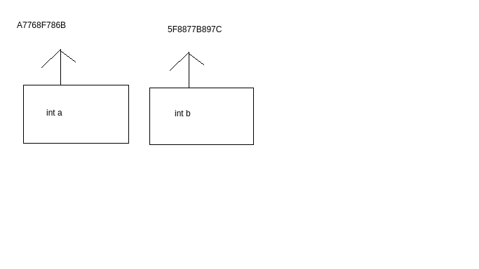
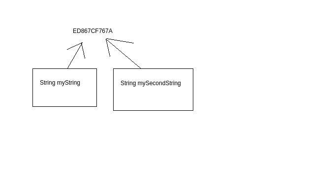
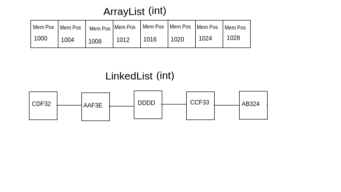
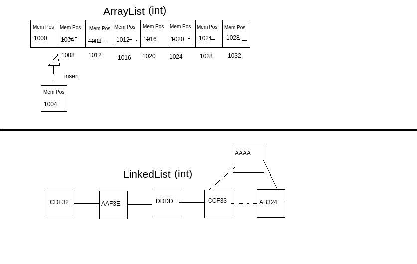
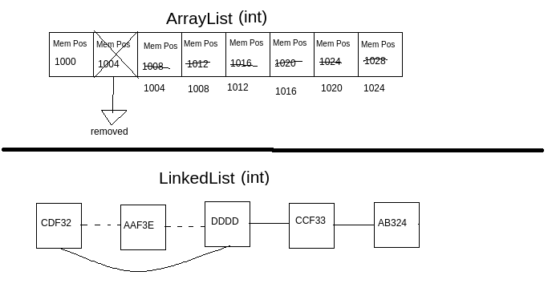

# Tim Buchalka's Java Programming Masterclass for Software Developers

A repository aimed to store code generated from [the course](https://www.udemy.com/course/java-the-complete-java-developer-course/).

## Table of contents
- [Some concepts](#some-concepts)
    - [Variables](#variables)
    - [Constants](#constants)
    - [Java packages](#java-packages)
    - [Indentation and whitespace](#indentation-and-whitespace)
    - [Scope](#scope)
    - [Class files](#class-files)
    - [Creating multiple classes in one Java file](#creating-multiple-classes-in-one-java-file)
    - [Reference types and reference values](#reference-types-and-reference-values)
- [Primitive types](#primitive-types)
    - [Integer](#integer)
    - [Byte](#byte)
    - [Short](#short)
    - [Long](#long)
    - [Float](#float)
    - [Double](#double)
    - [Char](#char)
    - [Boolean](#boolean)
    - [Casting in Java](#casting-in-java)
- [Strings](#strings)
    - [Parsing values from a string](#parsing-values-from-a-string)
    - [Reading user input](#reading-user-input)
    - [Comparing strings](#comparing-strings)
- [Operators, operands, and expressions](#operators,-operands,-and-expressions)
    - [Abbreviating operators](#abbreviating-operators)
    - [Logical AND operator](#logical-and-operator)
    - [Logical OR operator](#logical-or-operator)
- [If-else statement](#if-statement)
    - [If-then](#if-then)
    - [If-else](#if-else)
    - [Ternary operator](#ternary-operator)
- [Methods](#methods)
    - [Creating a method](#creating-a-method)
    - [Executing a method](#executing-a-method)
    - [Parameters](#parameters)
    - [Returning data from a method](#returning-data-from-a-method)
    - [Method overloading](#method-overloading)
- [Control flow statements](#control-flow-statements)
    - [Switch statement](#switch-statement)
    - [For statement](#for-statement)
    - [While statement](#while-statement)
    - [Do-while statement](#do-while-statement)
    - [Continue keyword](#continue-keyword)
- [Object oriented programming](#object-oriented-programming)
    - [Classes](#classes)
    - [Fields](#fields)
    - [Methods in classes](#methods-in-classes)
    - [The this keyword](#the-this-keyword)
    - [Objects](#objects)
    - [Constructors](#constructors)
    - [Passing a custom data type as an argument](#passing-a-custom-data-type-as-an-argument)
    - [Inheritance](#inheritance)
    - [Overriding methods](#overriding-methods)
    - [Notes about referencing, objects, instances, and classes](#notes-about-referencing,-objects,-instances,-and-classes)
    - [Notes about the this keyword and the super keyword](#notes-about-the-this-keyword-and-the-super-keyword)
    - [Static and instance methods](#static-and-instance-methods)
    - [Static and instance variables](#static-and-instance-variables)
    - [Composition](#composition)
    - [Using composition or inheritance](#using-composition-or-inheritance)
    - [Encapsulation](#encapsulation)
    - [Polymorphism](#polymorphism)
- [Arrays and lists](#arrays-and-lists)
    - [Arrays](#arrays)
    - [Lists and ArrayLists](#lists-and-arraylists)
    - [Autoboxing and unboxing](#autoboxing-and-unboxing)
    - [LinkedList](#linkedlist)

## Some concepts

Only a brief explanation on the elements used to create a "hello, world" in Java. They'll be better covered later on.

**Methods** are a collection of statements that perform an operation, like a function. They take in parameters and usually return a value.

Methods that don't return any information are void methods. We use the keyword "void" to define them.

The "main" is an special method that Java looks for when running a program. It's the entry point of any Java code. It's also a void method.

**Classes** are collections of methods that have similar functionalities.

**Modifiers** allows us to define the scope of a part of a code.

It defines wether other code can access ours.

An example:
```java
public class Hello {
    public static void main(String[] args) {
        System.out.println("Hello, world.");
    }
}
```

When we run this class, an IDE, in my case IntelliJ, runs this Java command on the background to compile the code:
```java
/usr/lib/jvm/java-11-amazon-corretto/bin/java -javaagent:/snap/intellij-idea-community/273/lib/idea_rt.jar=33897:/snap/intellij-idea-community/273/bin -Dfile.encoding=UTF-8 -classpath /home/gagibran/Repositories/Courses
```
Which outputs:
```
Process finished with exit code 0
```
If nothing goes wrong.

Java's print out statement is `System.out.println()`, which prints data and jumps a line.

We also have `System.out.print()`, which prints data without jumping a line.

All java lines **MUST** end with a semi-colon.

**`Static`, `void`, and `String[]` args will be discussed in detail later on.**

Additionally, [here's a cool guide](https://google.github.io/styleguide/javaguide.html) from Google on how to style a Java code.

### Variables

They store a value and allocate it in the RAM.

There are a lot of data types that can be stored in a variable, like integers, booleans, strings and so on.

To define a variable, we need to declare its data type:
```java
public class Hello {
    public static void main(String[] args) {
        int myFirstNumber = 5;
        System.out.println(myFirstNumber);
    }
}
```

**NOTE**: We use the camelCase notation in Java.

We can assign expressions to number data types:
```java
public class Hello {
    public static void main(String[] args) {
        int myFirstNumber = (5 + 10) * 3 + 3;
        System.out.println(myFirstNumber);
    }
}
```
This prints: `48`.

We can also create variables with expressions using other variables:
```java
public class Hello {
    public static void main(String[] args) {
        int myFirstNumber = (5 + 10) * 3 + 3;
        int mySecondNumber = 12;
        int myThirdNumber = 6;
        int myTotal = myFirstNumber + mySecondNumber - myThirdNumber + 3;
        int myLastOne = 1000 - myTotal;
        System.out.println(myLastOne);
    }
}
```
This prints out: `943`.

We can also concatenate string with variables by using the plus sign:
```java
public class Hello {
    public static void main(String[] args) {
        int myFirstNumber = (5 + 10) * 3 + 3;
        int mySecondNumber = 12;
        int myThirdNumber = 6;
        int myTotal = myFirstNumber + mySecondNumber - myThirdNumber + 3;
        int myLastOne = 1000 - myTotal;
        System.out.println("The value is " + myLastOne);
    }
}
```
Which prints out: `The value is 943`.

We can create variables without assigning any value to them, in a declaration statement:
```java
int newVar;
```
We can assign a value to it later on, in a expression statement:
```java
newVar = 50;
```

We can also assign a value to more than one variable in a declaration statement:
```java
int myVar;
int mySecondVar = myVar = 60;
```

### Constants

They are values declared outside of any methods.

They can be used by any methods inside their class and are unchangeable.

They're usually in uppercase.

To declare one, we need to use the **final** keyword.

Example:
```java
public class SecondsAndMinutesChallenge {

    // Constants:
    private static final String INVALID_VALUE_MESSAGE = "Invalid value";

    // Methods:
    public static String getDurationString(int minutes, int seconds) {
        if (minutes < 0 || seconds < 0 || seconds > 59) {
            return INVALID_VALUE_MESSAGE;
        }
        int hours = minutes / 60;
        int remainingMinutes = minutes % 60;
        String hoursString = hours + "h ";
        String minutesString = remainingMinutes + "m ";
        String secondsString = seconds + "s";
        if (hours < 10) {
            hoursString = "0" + hoursString;
        }
        if (remainingMinutes < 10) {
            minutesString = "0" + minutesString;
        }
        if (seconds < 10) {
            secondsString = "0" + secondsString;
        }
        return hoursString + minutesString + secondsString;
    }
    public static String getDurationString(int seconds) {
        // INVALID_VALUE_MESSAGE = "Hello"; // This doesn't work.
        if (seconds < 0) {
            return INVALID_VALUE_MESSAGE;
        }
        int minutes = seconds / 60;
        int remainingSeconds = seconds % 60;
        return getDurationString(minutes, remainingSeconds);
    }
}
```

### Java packages

A package is a way to organize our Java projects.

They have the convention of being the inverse domain of a company.

In my case:
```java
package com.fridaynightsoftwares;
```

The folder tree will look like:

src\com\fridaynightsoftwares\Main.java

### Indentation and whitespace

When Java converts a code into a readable JVM file, it strips out all whitespace and indentation from a program.

But adding whitespace is the best practice here, since it doesn't affect the speed of the program and it makes the code more human readable.

Whitespace actually only increases your file size, but it can be easily neglected as an actual concern.

This works, but it's bad practice:
```java
public class Main {
public static void main(String[] args) {
int
    testInt
    =
23;
}
}
```

We can take advantage of whitespace to make the code more readable when a statement is too big:
```java
public class Main {
    public static void main(String[] args) {
        System.out.println("looooooooooooooooooooooooooooooooooooooooooooong string string string string string " +
                        "string string string string string string string string string string " +
                        "string string string string string string string string string ");
    }
}
```

In conclusion, Java doesn't care about indentation, but it's good practice to do it.

### Scope

When a variable is created inside a code block, it can only be accessed inside that block. Example:
```java
public class Main {

    public static void main(String[] args) {
        int myVar = 12;

        if (myVar == 12) {
            int anotherVar = 13;
        }
        int aThirdVar = anotherVar; // Doesn't work.
        System.out.println(anotherVar); // Doesn't work.
    }
}
```
This code wouldn't run, because Java cannot resolve the variable "anotherVar".

This happens because when a code block finishes, any variables inside of it are marked for garbage collection ands, therefore, cannot be used anymore

Variables created outside of a code block, which is still executing, can be used by any code blocks that are inside this parent one:
```java
public class Main {
    public static void main(String[] args) {
        int myVar = 12;

        if (myVar == 12) {
            int anotherVar = myVar; // This works because the block "main" is still executing.
        }
    }
}
```

Since variables are marked for garbage disposal, we can recreate them inside the next block:
```java
public class Main {
    public static void main(String[] args) {
        int myVar = 12;
        if (myVar == 12) {
            int anotherVar = 42;
        }
        if (myVar >= 12) {
            int anotherVar = 44;
        } else {
            int anotherVar = 13;
        }
    }
}
```

### Class files

They are a binary file, the compiled version of a Java script.

They have the ".class" extension and normally, depending on the IDE, can be found under the project's directory, in "out/production/<className\>", where className is the name of the main class of our project.

If we have a package as a company, it stores under the company's package directory structure: "out/production/<className\>/com/fridaynightsoftwares".

### Creating multiple classes in one Java file

We can create multiple classes on a single file, but that is not good practice and should be avoided.

This is normally done when we need to create multiple small and compact classes that are no complicated and easy to maintain.

But they can only be accessed by classes on the same package and cannot have any access modifiers.

Example:
```java
package com.fridaynightsoftwares;

public class Main {

    public static void main(String[] args) {

    }
}

class Movie {
    private String name;

    public Movie(String name) {
        this.name = name;
    }

    public String plot() {
        return "No plot here.";
    }
}

class Jaws extends Movie {

    public Jaws() {
        super("Jaws");
    }

    @Override
    public String plot() {
        return "Shark eats a lot of people.";
    }
}

class IndependenceDay extends Movie {

    public IndependenceDay() {
        super("Independence Day");
    }

    @Override
    public String plot() {
        return "Aliens attempt to take over planet Earth.";
    }
}

class MazeRunner extends Movie {
    public MazeRunner() {
        super("Maze Runner");
    }

    @Override
    public String plot() {
        return "Kids try to escape a maze.";
    }
}

class StartWars extends Movie {
    public StartWars() {
        super("Star Wars");
    }

    @Override
    public String plot() {
        return "Imperial forces try to take over the galaxy.";
    }
}

class ForgettableMovie extends Movie {
    public ForgettableMovie() {
        super("Forgettable");
    }
}
```

### Reference types and reference values

All primitive types are **value types**, they hold a value. They allocate space on the stack memory and in the following example:
```java
int a = 10;
int b = a;
```
`a` and `b` are stored in different locations in the stack. So, changes made to `a` don't affect `b`, because `b` is **a copy** of `a`. The same works for the other primitive types.



Arrays, strings, and custom classes are **reference types**. They are allocated in the heap memory. In the following example:
```java
String myString = "A string";
String mySecondString = myString;
```
`myString` and `mySecondString` **are the same string**. We don't make a copy of `myString` when we assign it to `mySecondString`. We just point it to the same memory address in the heap. Thus, if we change `myString` to `String changed`, `mySecondString` will change to the same value. The same works for classes and arrays.

That's why we need to use the `equals()` method to compare the contents of two strings, for example, because using the equals operator (`==`) will compare if both strings are pointing to the same memory address.

Each element in array is stored in a different memory locations in the heap.



We can **dereference** a reference type by assigning a variable to a new value:
```java
String myString = "A string";
String mySecondString = myString; // Referenced.
mySecondString = "Another string"; // Dereferencing.
```

## Primitive types

### Integer

As the name says, used to store integer values.

It has a maximum and a minimum value. They can be found by calling the constants `MIN_VALUE` and `MAX_VALUE` inside the `Integer` wrapper class.

All eight primitive data types in Java have wrapper classes.

These are classes have variables and methods that do certain operations regarding the data type.

The `MIN_VALUE` and `MAX_VALUE` for the `Integer` wrapper class is:
```java
public class Main {
    public static void main(String[] args) {
        System.out.println(Integer.MIN_VALUE);
        System.out.println(Integer.MAX_VALUE);
    }
}
```

The values are:
- Minimum: -2147483648;
- Maximum: 2147483647.

What happens when we add 1 to 2147483647 or subtract 1 from -2147483648?
```java
public class Main {
    public static void main(String[] args) {
        int minValue = Integer.MIN_VALUE;
        int maxValue = Integer.MAX_VALUE;
        int bustedMin = minValue - 1;
        int bustedMax = maxValue + 1;
        System.out.println(minValue);
        System.out.println(maxValue);
        System.out.println("Busted min value: " + bustedMin);
        System.out.println("Busted max value: " + bustedMax);
    }
}
```

We get an **overflow** and an **underflow**, respectively.

Adding 1 to 2147483647 overflows the value to its minimum permitted: -2147483648.

The same thing happens when we subtract 1 from -2147483648. It underflows to the maximum value permitted of 2147483647.

If we try to declare:
```java
int bustedMax = 2147483648;
```
or
```java
int bustedMax = -2147483649;

```
The compiler will return an error, stating that the value is too big or too low.

We can also separate the decimals with an underscore, like so:
```java
int largeInt = 2_233_111_111;
```
To discern it the digits better.

It occupies 32 bits in the memory. Thus, it has a width of 32.

## Byte

It's not used very often, since the minimum and maximum values are -128 and 127, respectively.

Could be used if we want to store a number within that range to save memory, or increase performance.

It occupies 8 bits in the memory. Thus, it has a width of 8.

Can be used for documentation as well: if someone else is reading our could, they would know that the number passed into our byte variable is within that range.

It also has the `MAX_VALUE` and `MIN_VALUE` variables in the `Byte` wrapper class:
```java
public class Main {
    public static void main(String[] args) {
        byte minValue = Byte.MIN_VALUE;
        byte maxValue  = Byte.MAX_VALUE;
        System.out.println("Byte minimum value: " + minValue);
        System.out.println("Byte maximum value: " + maxValue);
    }
}
```
This will print out:
```
Byte minimum value: -128
Byte maximum value: 127
```

Like integers, we can also have it overflow or underflow.

### Short

Numbers in a range that are a little bigger than bytes.

It occupies 16 bits. Thus, its width is 16.

Short also has the `MAX_VALUE` and `MIN_VALUE` variables in the `Short` wrapper class:

```java
public class Main {
    public static void main(String[] args) {
        short minValue = Short.MIN_VALUE;
        short maxValue  = Short.MAX_VALUE;
        System.out.println("Short minimum value: " + minValue);
        System.out.println("Short maximum value: " + maxValue);
    }
}
```
Which prints:
```
Short minimum value: -32768
Short maximum value: 32767
```

It also overflows and underflows.

### Long

It has a bigger range than integers.

We can declare a long value for, say, a small number, by appending the letter "L" in the end of the number:
```java
long myLongValue = 100L;
```

The "L" can also be lowercase, but since it's easy to mix it up with 1, it's best practice to use uppercase "L".

It occupies 64 bits. Thus, it's width is 64.

By default, Java considers a number to be an integer unless we put the L in front of it to treat it as a long.

We won't get errors if we declare a long variable without an "L" like so:
```java
long myLongValue = 100;
```
Because an integer fits inside a long, since an integers' width is 32 bits. But Java will still treat the variable as an integer.

So, if we store an integer's maximum value plus one inside a long variable without the L in front, we get an error. This is forbidden:
```java
long myLongNumber = 2_147_483_648; // We'll get an error.
long myLongNumber = 2_147_483_648L; // This runs fine.
```

The same thing is valid for underflow and of the other data types.

As always, the minimum and maximum numbers can be derived from its wrapper class:
```java
public class Main {
    public static void main(String[] args) {
        long minValue = Long.MIN_VALUE;
        long maxValue  = Long.MAX_VALUE;
        System.out.println("Long minimum value: " + minValue);
        System.out.println("Long maximum value: " + maxValue);
    }
}
```
Which prints:
```
Long minimum value: -9223372036854775808
Long maximum value: 9223372036854775807
```

### Float

We use them when we need to express a fraction.

We express a floating point number with a decimal point.

Float is a **single** precision number.

Example:
```java
float 4.23F;
float 4.23f; // This works too.
// float 4.2; // This doesn't work.
```
We MUST specify that a number is a float but putting a "F" in front of the number, just like long data types.

Otherwise, we get an error stating that the variable was expecting a float, but got a double instead. This happens because **doubles are the default data type for rational numbers!**

It occupies 32 bits.

They range from 1.4E-45 to 3.4028235E38.

**FLoats are not recommended using anymore!**

### Double

These are **double** precision numbers, like:
```java
double doubleNum = 2_323.3;
double doubleNumTwo = 23.3_231;
```

They're more precise than floats.

They occupy 64 bits.

They range from 4.9E-324 to 1.7976931348623157E308.

We can specify that a number is a double but putting a "D" in front of the number, just like long data types:
```java
double doubleNum = 5D;
double doubleNum = 5d; // This also works.
double doubleNum = 5.0; // This also works.
```

When we do an operation with a primitive type for a whole number (integers, bytes, shorts and longs), we only get the whole number part of the division.

Floats and doubles allows us to get the fraction part of the number:
```java
public class Main {
    public static void main(String[] args) {
        int intVarDiv = 5 / 2;
        float floatVarDiv = 5f / 2f;
        double doubleVarDiv = 5d / 2d;
        System.out.println("Integer division: 5/2 = " + intVarDiv);
        System.out.println("Float division: 5f/2f = " + floatVarDiv);
        System.out.println("Double division: 5d/2d = " + doubleVarDiv);
    }
}
```
This will print out:
```
Integer division: 5/2 = 2
Float division: 5f/2f = 2.5
Double division: 5d/2d = 2.5
```

Since doubles are more precise than integers, we get more decimals in an division:
```java
public class Main {
    public static void main(String[] args) {
        float floatVarDiv = 5f / 3f;
        double doubleVarDiv = 5d / 3d;
        System.out.println("Float division: 5f/2f = " + floatVarDiv);
        System.out.println("Double division: 5d/2d = " + doubleVarDiv);
    }
}
```
Gives us:
```
Float division: 5f/2f = 1.6666666
Double division: 5d/2d = 1.6666666666666667
```

**This is also recommended over floats because moderns computers processes them faster than floats, at the chip level.**

Lastly, doubles are great for general floating-point operations, but are not recommended for very precise operations, such as currency calculations, due to a limitation on how floating numbers are stored in the memory (not a Java limitation).

For these kinds of operations, we use a class called "BigDecimals", which will be explained later on.

### Char

Chars are different than strings, because they only accept one character instead of a whole string of characters.

Example:
```java
char newChar = 'D'; // This works;
char newCharTwo = 'De' // This returns an error.
```

Chars were useful when Java was first release, because saving memory was crucial to any program.

Nowadays, computers have so much more memory that this data type is not very useful anymore.

It occupies 16 bits of memory (a width of 16).

The reason that it doesn't occupy just a single byte (8 bits) is because we can store unicode characters.

Unicode is an international encoding standard for use with different languages and scripts, by each letter, digit, or symbol is assigned a unique numeric value that applies across different platforms and programs.

Unicode has 65,535 different types of characters that are represented with 2 bytes.

We can see the complete table in [the Unicode-table website](https://unicode-table.com/en/).

We can get a character's unicode by looking at the table on the website, where the number on the column is added to the number on the row.

An example, the unicode for character "D" is U+0044.

We can put this unicode in a Java's char type:
```java
public class Main {
    public static void main(String[] args) {
        char charD = '\u0044';
        char copyRight = '\u00A9' // '\u00a9' also works.
        System.out.println(charD) // Prints out 'D'.
        System.out.println(copyRight) // Prints out the copyright symbol.
    }
}
```
We have to escape the character 'u' with a backslash, because it actually represents that this is actually unicode.

Letters composing a unicode can be uppercase or lowercase.

### Boolean

True or false, yes or no, 1 or 0.

Pretty useful in any programming language.

Example:
```java
boolean isCustomerOverTwentyOne = false;
boolean isCustomerEighteen = true;
```

It's best practice to start the name of a boolean variable with "is".

### Casting in Java

Data types can be casted into other types if were mixing them with operations. The following
```java
byte minDivided = byteMinValue / 2;
```
Gives us an error that it was requiring a byte to be assigned to "minDivided", but it got an integer instead.

Even though we know that -128 divided by 2 is equal to -64 and it would fit into a byte type, our computer treats the result of this division as an integer, because the number 2 is being defaulted to an integer.

We can solve this issue by casting the whole expression to a byte. The syntax is:
```java
byte minDivided = (byte) (byteMinValue / 2);
```

The same can be applied to short and long.

Integers are the whole numbers that we use the most. That's why they're the default data type in Java.

We can also cast a double to be a float:
```java
float floatVar = (float) 5.25;
```
Although casting to a float like that is not recommended. People tend to just put the "F" in front of the number.

## Strings

It's not a primitive type. It's a class that Java programmers treat differently.

A string can contain a sequence of characters, only limited by the memory, or by its maximum value of an int, that is **2.14 Billion**.

Example:
```java
public class Main {
    public static void main(String[] args) {
        String stringVar = "This is a string.";
        System.out.println("My string is: " + stringVar);
    }
}
```

Like we were doing on Sys.tem.out.println(), we can concatenate strings by using the plus operator:
```java
String stringVar = "This is a string.";
String stringVarTwo = stringVar + "copyright: \u00a9";
```

We can cast a data type into a string:
```java
public class Main {
    public static void main(String[] args) {
        String lastString = "50";
        int intNum = 45;
        String strPlusNum = intNum + lastString;
        System.out.println("This is a string: " + strPlusNum);
    }
}
```
This prints out:
```
This is a string: 4550
```

The same works for the other data types.

**Strings are immutable**: we can't change a string after it's been created.

Instead, when we want to modify a string, a new one is created.

This means that the variable "testString" here:
```java
public class Main {
    public static void main(String[] args) {
        String testString = "Test.";
        testString = "Trying to change the string.";
        System.out.println(testString);
    }
}
```
Isn't overwritten by "Trying to change the string.". Instead, Java deletes this one and creates a new string, with the same name, for us.

### Parsing values from a string

In many cases we have to convert a string into some other data type, such as an int.

One of the cases is when we read input from an user using the `Scanner` class.

We can use a **parsing method** to convert it into a primitive data type.

Example of parsing it into an integer using its parsing method:
```java
public class Main {
    public static void main(String[] args) {
        String numberAsString = "2018"; // Interpreted as text.
        int number  = Integer.parseInt(numberAsString); // Parsing it as a string.
    }
}
```
Here we have the `Integer` wrapper class and its `static` parsing method, `parseInt()`.

This method will try to convert the string into an integer. The parsing will be successful if the string is, indeed, a number.

Thus, in this example:
```java
public class Main {
    public static void main(String[] args) {
        String numberAsString = "2018a"; // Interpreted as text.
        int number  = Integer.parseInt(numberAsString); // Doesn't work.
    }
}
```
We would get an error, because **2018a** is not a number.

This parsing naturally works with other data types, as long as the parsing is valid.

An example for double:
```java
public class Main {
    public static void main(String[] args) {
        String numberAsString = "2018.123"; // Interpreted as text.
        double number  = Double.parseDouble(numberAsString); // Parsed as double.
    }
}
```

### Reading user input

We can get user input by creating a variable of type `Scanner`, which, like [strings](#strings), is a custom class, not a primitive type.

The `Scanner` class is define inside a package called `java.util.Scanner`, thus it has to be imported by our code for this to work.

We can use this module by stating its import in the beginning of our code.

The `new` keyword is further detailed in [classes](#classes), but we use it to create an **instance** of the class.

The `Scanner` class takes the argument `System.in`, which allows us to read input from users of our application.

An example:
```java
import java.util.Scanner;

public class Main {
    public static void main(String[] args) {
        Scanner scanner = new Scanner(System.in);
        System.out.println("Enter your name: ");
        String name = scanner.nextLine();
        scanner.close();
        System.out.println(name);
    }
}
```
Here we also have the string `name` equal to the method `nextLine()` from the `Scanner` class (lowercase `Scanner` is just an instance of the `Scanner` class).

This means that the input will be stored in the `name` variable.

Afterwards, we close the class for memory cleaning by using the `close()` method from the `Scanner` class.

When we run this code snippet, we'll be prompted to input our name in the console:


This prints out:
```
Enter your name: 
Gabriel
Gabriel
```

We can automatically get an input as an integer by using the method `nextInt()` from the `Scanner` class:
```java
import java.util.Scanner;

public class Main {
    public static void main(String[] args) {
        Scanner scanner = new Scanner(System.in);
        System.out.println("Enter your year of birth: ");
        int yearOfBirth = scanner.nextInt();
        scanner.close();
        System.out.println(2021 - yearOfBirth);
    }
}
```
For an input of `1994`, this prints out:
```
Enter your year of birth:
1994
27
```

The `Scanner` class has methods to read all primitive data types, like
`nextByte()`, `nextShort()` etc.

**A very important note**: since these data type methods don't actually jump a line, like `nextLine()` do, if we stack one of them with a `nextLine()`, it will skip this input.

This happens because internally, the scanner is checking for a line separator, so when we hit the `enter` key, it serves as input to feed `nextLine()`.

The solution is to place another `nextLine()` method, but without assigning it to any variable, just to be fed this enter key that we press when we input a number.

Example:
```java
import java.util.Scanner;

public class Main {
    public static void main(String[] args) {
        Scanner scanner = new Scanner(System.in);
        System.out.println("Enter your year of birth: ");
        int yearOfBirth = scanner.nextInt();
        System.out.println("Enter your name: ");
        String name = scanner.nextLine();
        System.out.println(name);
        System.out.println(2021 - yearOfBirth);
        scanner.close();
    }
}
```
For the input `1994`, this will output:
```
Enter your year of birth: 
1994
Enter your name: 

27
```
Note how it skips the `enter your name` input.

The fix:
```java
import java.util.Scanner;

public class Main {
    public static void main(String[] args) {
        Scanner scanner = new Scanner(System.in);
        System.out.println("Enter your year of birth: ");
        int yearOfBirth = scanner.nextInt();
        scanner.nextLine(); // Handling the "next line" character. No variables assigned.
        System.out.println("Enter your name: ");
        String name = scanner.nextLine();
        System.out.println(name);
        System.out.println(2021 - yearOfBirth);
        scanner.close();
    }
}
```
Which prints out:
```
Enter your year of birth: 
1994
Enter your name: 
Gabriel
Gabriel
27
```

**A second problem that we have to take care** is when an user inputs a different data type that is being requested by the program.

We can handle this by using the `hasNextInt()` method from the `Scanner` class. This method returns wether the next input entered is of type `int`.

We can use this inside an if-else or switch statement:
```java
import java.util.Scanner;

public class Main {
    public static void main(String[] args) {
        Scanner scanner = new Scanner(System.in);
        System.out.println("Enter your year of birth: ");
        boolean isInt = scanner.hasNextInt();
        int yearOfBirth = scanner.nextInt();
        scanner.nextLine(); // Handling the "next line" character. No variables assigned.
        System.out.println("Enter your name: ");
        String name = scanner.nextLine();
        scanner.close();
        System.out.println(name);
        if (isInt && yearOfBirth >= 0 && yearOfBirth <= 2021) {
            System.out.println(2021 - yearOfBirth);
        } else {
            System.out.println("Invalid year.");
        }
    }
}
```
If the variable `yearOfBirth` is not in the range of 0 (included) and 2021 (included) and if it's not an integer, it outputs `Invalid year.`

This method is available for the other primitive types, like `hasNextByte()`, `hasNextShort()` etc.

### Comparing strings

There is a useful method from the `String` class that allows us to compare strings lexicographically, based on the unicode of each individual character on it, the `compareTo()` method. We pass the string to be compared as a parameter to the method:

```java
String test = "Test string";
int comparisonOne = test.compareTo("Test string"); // Returns 0. All unicode are equal.
int comparisonTwo = test.compareTo("A string"); // Returns 19. Unicodes have bigger values.
int comparisonThree = test.compareTo("W string"); // Return -3. Unicodes have smaller values.
```

This method can be used to order strings alphabetically.

## Operators, operands, and expressions

They're special symbols that perform specific operations in one, two, or three operands, forming an expression.

[This is the official documentation for all operators from Oracle.](https://docs.oracle.com/javase/tutorial/java/nutsandbolts/opsummary.html)

[This is the official documentation of the priority, of precedence, of the operators.](https://docs.oracle.com/javase/tutorial/java/nutsandbolts/operators.html) We learn most of those in school.

[This is a document stating the associativity of each operator.](http://www.cs.bilkent.edu.tr/~guvenir/courses/CS101/op_precedence.html)

As an example, we have plus, minus, multiplication, and division operators.

The equal operator (=) is used to assign variables to values.

The remainder, or modulo, operation returns the remainder of a division:
```java
int aNum = 3;
int anotherNum = 77;
int remaind = anotherNum % aNum; // Returns 2.
```

### Abbreviating operators

We can abbreviate updates different than by one:
```java
number += 2; // Abbreviates int number = number + 2.
number -=2; // Abbreviates int number = number + 2.
number *= 2; // Abbreviates int number = number * 2.
number /= 2; // Abbreviates int number = number / 2.
number %= 2; // Abbreviates int number = number % 2.
```

### Increment and decrement

We can abbreviate the operators that update a unit of a value utilizing the **decrement** (--) or the **increment** (++) operators.

They can be used as as:
1. Prefix: When the value is updated **BEFORE** the update is processed;
2. Postfix: When the value is updated **AFTER** the update is processed;

An example with prefix:
```java
public class Main {
    public static void main(String[] args) {
        int anInt = 4;
        System.out.println(++anInt); // Increment with prefix: prints out 5.
    }
}
```

An example with postfix:
```java
public class Main {
    public static void main(String[] args) {
        int anInt = 4;
        System.out.println(anInt--); // Decrement with postfix: prints out 4, because the variable is updated BEFORE the processing.
    }
}
```

### Logical AND operator

It's another primitive type.

The variable is assigned to true when two or more conditions are met **at the same time** and to false otherwise.

Its symbol is the double [ampersand](https://en.wikipedia.org/wiki/Ampersand#:~:text=The%20ampersand%2C%20also%20known%20as,%E2%80%94Latin%20for%20%22and%22.) (&&).

A single ampersand (&), which is a [bitwise operation](https://en.wikipedia.org/wiki/Bitwise_operation), can also be used, but it's best practice to use two.

Example:
```java
public class Main {
    public static void main(String[] args) {
        boolean areBothTrue = 40 <= 100 & 32 > 10; // This is true.
        boolean areTheseTrue = 100 >= 100 & 40 <= 34; // The second condition is false.
        System.out.println(areBothTrue); // Prints out true.
        System.out.println(areTheseTrue); // Prints out false
    }
}
```

### Logical OR operator

It's another primitive type.

The variable is assigned to true or false when at **least one condition is met** and to false otherwise.

Its symbol is the double pipe (||).

Single pipe (|), which is a [bitwise operation](https://en.wikipedia.org/wiki/Bitwise_operation), can also be used, but it's best practice to use two.

Example:
```java
public class Main {
    public static void main(String[] args) {
        boolean areBothTrue = 40 == 100 | 32 < 10; // Both are false.
        boolean areTheseTrue = 100 >= 100 || 40 >= 34; // The second condition is false, but the first is true.
        System.out.println(areBothTrue); // Prints out false.
        System.out.println(areTheseTrue); // Prints out true.
    }
}
```

## If statement

### If-then

Most basic flow control tool in Java - or in any programming language.

Allows us to execute code based on the outcome of a **conditional** expression that returns true or false.


Example:
```java
public class Main {
    public static void main(String[] args) {
        boolean isAlien = false;
        if (isAlien == false) {
            System.out.println("It is not an alien!");
        }

        if (!isAlien) { // Also works.
            System.out.println("It is not an alien!");
        }
    }
}
```

We utilize the **equality operators** to check if a conditional is true or false.

We use (==) to check if two operands are equal and (!=) to check if the operands are different.

We can abbreviate these operands with only the NOT operator (!) to check if an operand is equal to false (i.e. !isAlien) and just the name of the variable to check if it's equal to true (isAlien):
```java
public class Main {
    public static void main(String[] args) {
        boolean isAlien = false;
        if (!isAlien) {
            System.out.println("It is not an alien!");
        }

        if (isAlien) { // Also works.
            System.out.println("It is an alien!");
        }
    }
}
```

The logical operators [AND](#local-and-operator) and [OR](#logical-or-operator) can be used to form more complex expressions:

```java
public class Main {
    public static void main(String[] args) {
        boolean isAlien = false;
        if (!isAlien && 100 > 40) { // A and B are true.
            System.out.println("It is not an alien!");
        }

        if (isAlien || 100 > 40) { // At least B is true.
            System.out.println("It is not an alien!");
        }

        // Mixing both:
        if ((isAlien || 100 > 40) && (!isAlien || 100 <= 40)) { // B and C are true.
            System.out.println("It is not an alien!"); // Condition is met.
        }
    }
}
```

**Note** that we can write an if statement without the curly brackets and/or without any indentation, **but only the first line will be executed depending on the if check**, the other one will be executed no matter the outcome:
```java
public class Main {
    public static void main(String[] args) {
        if (isAlien)
            System.out.println("It is an alien!");
        
        if (isAlien)
System.out.println("It is an alien!"); // This works too!
        

        if (!isAlien)
System.out.println("It is not an alien!"); // This works, but it's not good practice.
    System.out.println("I'm scared!"); // This will get executed, no matter the outcome of the if-statement.
    }
}
```

This obviously is not a good practice and should be done never.

### If-else

With the if-else statement, it's possible to execute multiple code to specific conditions to our code:
```java
public class Main {
    public static void main(String[] args) {
        // If-else:
        double numA = 32.32;
        double numB = 32.32;
        boolean boolA = false;
        if (numA > numB) {
            System.out.println("numA is greater than numB.");
        } else if (numA == numB) {
            System.out.println("The numbers are equal or boolA is false.");
        } else {
            System.out.println("Something else.");
        }
    }
}
```
In this example, the "else if" condition will be met.

We can actually put as many "else if" blocks as we want.

**NOTE**: We should always revise the logic behind these statements. In this next example, despite the conditions on both "if" and "else if" blocks are met, **it will execute the first occurrence of a true value!**
```java
public class Main {
    public static void main(String[] args) {
        // If-else:
        double numA = 32.32;
        double numB = -32.12;
        boolean boolA = false;
        if (numA > numB) {
            System.out.println("numA is greater than numB."); // This will be the one that's executed, despite the below condition is also met.
        } else if (numA == numB || !boolA) {
            System.out.println("The numbers are equal or boolA is false.");
        } else {
            System.out.println("Something else.");
        }
    }
}
```
We could fix this by changing the "else if" to a separated "if" block:
```java
public class Main {
    public static void main(String[] args) {
        // If-else:
        double numA = 32.32;
        double numB = -32.12;
        boolean boolA = false;
        if (numA > numB) {
            System.out.println("numA is greater than numB."); // This will be the one that's executed, despite the below condition is also met.
        }
        if (numA == numB || !boolA) {
            System.out.println("The numbers are equal or boolA is false.");
        } else {
            System.out.println("Something else.");
        }
    }
}
```
Then, both blocks are executed individually.

### Ternary operator

It's called "ternary" because it takes in three operands.

It takes in the condition that we're testing, the value to assign if it meets the condition, and finally,the value to assign if it doesn't.

It's a one-liner to assign a value to a variable if a condition is met, or assign another value to a variable if the condition isn't met.

So, this:
```java
boolean isCar = false;
if (isCar) {
    boolean wasCar = true;
} else {
    boolean wasCar = false;
}
```
Can be simplified to this:
```java
boolean isCar = false;
boolean wasCar = isCar ? true : false; // wasCar will be false.
```
Where "isCar", short for "wasCar == true", is the condition we're checking, "true" is the value that the variable "wasCar" will be assign if the condition is met, and "false" is the value that the variable will be assign in case the condition is not met.

Another example:
```java
boolean isCar = false;
boolean !wasCar = isCar ? false : true; // wasCar will be true.
```

## Methods

Functions **defined inside classes**.

They reduce code duplication.

They can be defined in any order inside our code and be called in any order.

### Creating a method

The syntax is:
```
<modifier> <returnType> <methodName> (<parameters>) {
}
```

Just like the "main" method, in which we have "public static" modifiers, a return type "void", "main" as the method name, and "String[] args" as the parameter.

Example:
```java
public class MyMethod {
    public static void calculateScore() {
        boolean isGameOver = true;
        int score = 800;
        int levelCompleted = 5;
        int bonus = 100;
        if (isGameOver) {
            int finalScore = score + (levelCompleted * bonus);
            finalScore += 1000;
            System.out.println("Your final score was " + finalScore);
        }
    }
}
```

### Executing a method

Like previously stated, a method can be called anywhere, even before it's defined, as long as the calling is withing the same [scope](#scope) as the method declaration.

Example:
```java
package com.fridaynightsoftwares;

public class MyMethod {
    public static void main(String[] args) {
        boolean isGameOver = true;
        int score = 800;
        int levelCompleted = 5;
        int bonus = 100;

        calculateScore(); // Calling the method.

        score = 10000;
        levelCompleted = 8;
        bonus = 200;
        if (isGameOver) {
            int finalScore = score + (levelCompleted * bonus);
            System.out.println("Your final score was " + finalScore);
        }
    }

    public static void calculateScore() {
        boolean isGameOver = true;
        int score = 800;
        int levelCompleted = 5;
        int bonus = 100;
        if (isGameOver) {
            int finalScore = score + (levelCompleted * bonus);
            finalScore += 1000;
            System.out.println("Your final score was " + finalScore);
        }
    }
}
```

### Parameters

Methods can have zero or more parameters.

A single parameter have a **data type and a variable name**.

Multiple parameters are separated by come.

Example:
```java
public class MyMethod {
    public static void main(String[] args) {

        // Declaring the variables and assigning a value to them:
        boolean isGameOver = true;
        int score = 800;
        int levelCompleted = 5;
        int bonus = 100;

        // Executing the method with these values:
        calculateScore(isGameOver, score, levelCompleted, bonus);

        // Changing some values for the variables:
        score = 10000;
        levelCompleted = 8;
        bonus = 200;

        // Executing the method with the changed values:
        calculateScore(isGameOver, score, levelCompleted, bonus);
    }

    // We can indent the parameters like so:
    public static void calculateScore(boolean isGameOver, int score, 
                                      int levelCompleted, int bonus) {
        if (isGameOver) {
            int finalScore = score + (levelCompleted * bonus);
            finalScore += 1000;
            System.out.println("Your final score was " + finalScore);
        }
    }
}
```
Since parameters are define inside the scope of a method, variables outside of their scope can have the same name as their parameters, like the variables "isGameOver", "score", "levelCompleted", and "bonus".

We can also pass the values directly into the parameters, without the need of declaring variables with values:
```java
public class MyMethod {
    public static void main(String[] args) {

        calculateScore(true, 100, 200, 100);
    }

    public static void calculateScore(boolean isGameOver, int score, 
                                      int levelCompleted, int bonus) {
        if (isGameOver) {
            int finalScore = score + (levelCompleted * bonus);
            finalScore += 1000;
            System.out.println("Your final score was " + finalScore);
        }
    }
}
```

### Returning data from a method

We can return a value that's been processed inside a non-void method.

This is good for code reusability.

Here, the \<returnType\> in the a method declaration will be the data type that it returns after processing.

Methods **can only return a single value**.

The last statement executed in a method **MUST** be a return.

No matter where a return statement is, the method will end when it hits it.

It's not good practice to have **to many** return statements inside a method, because it's hard to keep track of the control flow. **BUT**, it's fine to have multiple return types for the sake of readability.

If we try to put any statement after a return, Java won't compile. It will give us an error of "Unreachable statement". This happens because, like previously explained, Java exists a method when it encounters a return statement.

Example:
```java
public class MyMethod {
    public static void main(String[] args) {

        // Saving the output of the method into a variable:
        int playerScore = calculateScore(false, 100, 200, 300);

        // Printing out the value:
        System.out.println("Your final score was " + playerScore);
    }

    // The function returning a data type of int:
    public static int calculateScore(boolean isGameOver, int score,
                                      int levelCompleted, int bonus) {
        int finalScore;
        if (isGameOver) {
            finalScore = score + levelCompleted * bonus;
            finalScore += 1000;
        } else {
            finalScore = -1;
        }
        return finalScore;
    }
}
```
The -1 value here indicates that the game isn't over yet, it's still running. By convention, we tend to use -1 to indicate errors, but it could be any number, as long as it made sense.

This code could be made more readable if we had **two** return types:
```java
public class MyMethod {
    public static void main(String[] args) {

        // Saving the output of the method into a variable:
        int playerScore = calculateScore(false, 100, 200, 300);

        // Printing out the value:
        System.out.println("Your final score was " + playerScore);
    }

    // The function returning a data type of int:
    public static int calculateScore(boolean isGameOver, int score,
                                      int levelCompleted, int bonus) {
        int finalScore;
        if (isGameOver) {
            finalScore = score + levelCompleted * bonus;
            finalScore += 1000;
            return finalScore // Exits the method if it gets here.
        }
        return -1; // Exits the method if it gets here.
    }
}
```

### Method overloading

This is a feature that allows the same method to process different types of data.

Java developers often refer to it as **compile time polymorphism**, even though it has nothing to do with polymorphism in classes.

This increases the readability of the code. [This Stack Overflow discussion](https://stackoverflow.com/questions/38537340/why-should-i-ever-overload-methods) is a good example on when we would use overloading.

In practice, we declare the same method with different arguments.

When declaring an overload method, the modifiers can differ **but the return type MUST be the same as the other methods!**

Example:
```java
public class Overloading {

    // This ones work:
    public static int overloadedMethod(int a, int b) {
        return a + b;
    }
    private int overloadedMethod(double a, float b) {

        return (int) (a / b + b * a);
    }
    public int overloadedMethod(double a, double b) {
        System.out.println("a + b test");
        return (int) (a + b);
    }
        public static int overloadedMethod(float a, double b, int c) {
        if (a > b) {
            return c;
        }
        return (int) (a + b);
    }

    // Return type is different. This doesn't work:
    private double test(String a, double b, char c) {
        return (int) (a + b);
    }

    // This one doesn't work either, because the method is already defined with these arguments:
    public int overloadedMethod(double a, double b) {
        return a * b % a
    }
}
```

A more practical example: we have to make a method that has to calculate the sum of two integers, the sum of three doubles, and the multiplication of two doubles and two integers:
```java
public class Overloading {
    public static double processingOfNumbers(int a, int b) {
        return a + b;
    }
    public static double processingOfNumbers(double a, double b, double c) {
        return a + b + c;
    }
    public static double processingOfNumbers(double a, double b, int c, int d) {
        return a * b * c * d;
    }
}
```
We do that instead of having to create three methods with different names that do almost the same thing.

We can overload `static` and **instance** methods.

We can also overload methods that come from a [parent class](#inheritance) (derived methods) when we're dealing with [inheritance](#inheritances).

## Control flow statements

They allow us to change the flow of the bit of code that will be executed.

There are four essentials:
1. [Switch statement](#switch-statement);
2. [For statement](#for-statement);
3. [While statement](#while-statement);
4. [Do-while statement](#do-while-statement).

### Switch statement

When we have multiple **single** conditions **that test for a constant** to be met, it can get messy very easily if we use if-else statements.

We can use switch statements instead. It's more readable and easier to understand what's going on the code.

Example, this if-statement:
```java
public class Main {
    public static void main(String[] args) {
        int value = 1;

        // Using if-else statement:
        if (value == 1) {
            System.out.println("Value was 1");
        } else if (value == 2) {
            System.out.println("Value was 2");
        } else {
            System.out.println("Value was neither 1 or 2");
        }
    }
}
```
Can be translated to this switch statement:
```java
public class Main {
    public static void main(String[] args) {
        int switchValue = 1;
        switch (switchValue) {
            case 1:
                System.out.println("Value was 1");
                break;
            case 2:
                System.out.println("Value was 2");
                break;
            default:
                System.out.println("Value was neither 1 or 2");
                break;
        }
    }
}
```
**Note here that we're testing for a constant. Booleans are not allowed in a switch-case!**

**The syntax** of a switch statement is somewhat similar to an if-else statement.

We utilize the keyword **switch** followed by the variable to be tested inside the parenthesis.

Inside the curly brackets, we utilize the keyword `Case` followed by the condition to be tested. In the example, **case 1** is testing if the variable **switchValue** is equal to 1.

Normally, the flow would continue to the next case, even if the condition isn't met (i.e. it wouldn't print "Value was 1"). Thus, we utilize the keyword **break** to break out from the statement and not go to the next case.

Thus, without a **break** when a condition is met, it executes the rest of the cases in cascade, even though their conditions are not true.

Finally, we utilize the keyword **default** to act like an **else** statement: if no condition of the other cases met, it falls inside **default**.

**Note that there are no curly brackets wrapping the cases, nor the default.**

We can also group up cases that need to execute the same code:
```java
public class Main {
    public static void main(String[] args) {
        int switchValue = 1;
        switch (switchValue) {
            case 1:
                System.out.println("Value was 1");
                break;
            case 2:
                System.out.println("Value was 2");
                break;
            case 3: case 4: case 5:
                System.out.println("Value was 3, 4, or 5");
                break;
            default:
                System.out.println("Value was not 1, 2, 3, nor 5");
                break;
        }
    }
}
```
or
```java
public class Main {
    public static void main(String[] args) {
        int switchValue = 1;
        switch (switchValue) {
            case 1:
                System.out.println("Value was 1");
                break;
            case 2:
                System.out.println("Value was 2");
                break;
            case 3:
            case 4:
            case 5:
                System.out.println("Value was 3, 4, or 5");
                break;
            default:
                System.out.println("Value was not 1, 2, 3, nor 5");
                break;
        }
    }
}
```

Technically, we don't need to include a **break** in the last case (or default), because it's the end of the statement, but it's good practice to include to maintain readability of our code through consistency.

**With the exception of booleans**, we can use any of the primitive types in a switch statement. From JDK 7 we can also test for strings:
```java
public class Main {
    public static void main(String[] args) {
        String month = "January";
        switch (month) {
            case "January":
                System.out.println("Jan");
                break;
            case "June":
                System.out.println("Jun");
                break;
            default:
                System.out.println("Not Jan or Jun");
                break;
        }
    }
}
```

**We just have to be careful with uppercase and lowercase for chars and strings, since Java is case sensitive.**

For strings, we can deal with this problem by applying the `toLowerCase()` method from the **String** wrapper class to make all characters of a string lowercase:
```java
public class Main {
    public static void main(String[] args) {
        String month = "January";
        switch (month.toLowerCase()) {
            case "january":
                System.out.println("Jan");
                break;
            case "june":
                System.out.println("Jun");
                break;
            default:
                System.out.println("Not Jan or Jun");
                break;
        }
    }
}
```

### For statement

It allows us to execute code a certain amount of times.

Very commonly needed in programming.

An example:
```java
public class Main {
    public static void main(String[] args) {
        for (int i = 0; i < 10; i++) {
            System.out.println(calculateInterest(1000.0, i));
        }
    }
    public static double calculateInterest(double amount, double interestRate) {
        return amount * (interestRate / 100);
    }
}
```
Which prints:
```
0.0
10.0
20.0
30.0
40.0
50.0
60.0
70.0
80.0
90.0
```

The syntax is:
```java
for (initialization; condition; increment) {
    // Do stuff.
}
```
Where **initialization** is a declared variable to be incremented. This variables will be deleted after de loop is finished, so it will be unaccessible after that. This means that another variable, with the same name and different (or same) data type, can be created **outside** this loop. In the above example, we have **init it = 0;**.

The loop finished when the **condition** is met. So, it should start with a false value and exit the loop when it's true. In the above example, we have **i < 10;**, meaning that the loop will iterate the last time when **i** equals 9.

Finally, increment is how much we want to increment the initialization variable. In the example above, we're incrementing it by 1 each iteration.

The increment could also be a decrement, like **i--**.

We can use the keyword **break** here to break out of a for loop whenever we want, without having to meet the condition. Example:
```java
public class Main {
    public static void main(String[] args) {
        for (int i = 0; i < 100; i++) {
            System.out.println(i);
            if (i == 3) {
                break;
            }
        }
    }
}
```
Despite requiring the condition of **i < 100** to break out of this for loop, when **i** hits 3, it breaks out of it. This prints out:
```
1
2
3
```

### While statement

When we don't know how many times we really want to iterate through a condition.

Example:
```java
public class Main {
    public static void main(String[] args) {
        int count = 0;
        while (count != 5) {
            System.out.println(count);
            count++;
        }
    }
}
```
Prints out:
```
0
1
2
3
4
```
This example is equivalent to:
```java
public class Main {
    public static void main(String[] args) {
        for (int i = 0; i != 5; i++) {
            System.out.println(i);
        }
    }
}
```

We can also run a while loop **forever**, but we have to be careful to not get stuck in a **infinite loop**. For that, we need to break out the loop when it meets a certain condition:
```java
public class Main {
    public static void main(String[] args) {
        int count = 0;
        while (true) {
            System.out.println(count);
            count ++;
            if (count == 5) {
                break;
            }
        }
    }
}
```
The condition **true** is always **true**, so it runs forever until **count** is equal to **5**.

This also prints out:
```
0
1
2
3
4
```

### Do-while statement

This kind of loop will **always execute the code inside of it at least once**.

Example:
```java
do {
public class Main {
    public static void main(String[] args) {
        int count = 0;
        do {
            System.out.println(count);
            count++;
        } while (count != 5);
    }
}
```
Outputs:
```
0
1
2
3
4
```

What's happening here is that the code inside of **do** will be executed and **after** the execution, the **count** variable will be tested inside of **while**.

It's pretty much doing what the statement says: ***do** a print out of the count variable and increment it afterwards **while** the variable is different than 5.*

We still have to be careful of falling into a **infinite loop**. For example:
```java
do {
public class Main {
    public static void main(String[] args) {
        int count = 5;
        do {
            System.out.println(count);
            count++;
        } while (count != 5);
    }
}
```
The code inside **do** will be executed **before** the condition is tested in **while**, even though **count** is equal to **5**.

So firstly, **count** will be incremented and then tested. It will check that **count** is now **6**, thus being different than **5**, and the loop will run **forever**.

In this case, we could either change the condition to **count <= 5**, or put a **break** inside of the loop:
```java
public class Main {
    public static void main(String[] args) {
        int count = 5;
        do {
            System.out.println(count);
            count++;
            if (count >= 30) {
                break;
            }
        } while (count != 5); // Be aware of the semicolon!
    }
}
```
This prints out:
```
5
6
7
8
9
10
11
12
13
14
15
16
17
18
19
20
21
22
23
24
25
26
27
28
29
```
Although this doesn't make any sense, because we could've just used a plain old [while statement](#while-statement) there.

### Continue keyword

This keyword can be used inside the loops to make it go to the next iteration **without executing the code below it**.

An example:
```java
public class Main {
    public static void main(String[] args) {
        for (int i = 0; i < 20; i++) {
            if (i % 2 == 0) {
                continue;
            }
            System.out.println(i);
        }
    }
}
```
This prints out:
```
1
3
5
7
9
11
13
15
17
19
```
Because whenever **i** is **even**, it hits the **continue** keyword and go to the next iteration **without** printing **i**.

It breaks from the current iteration and goes to the next one.

This also works in a [while statement](#while-statement) and in a [do-while statement](#do-while-statement)

## Object oriented programming

Objects have two major characteristics:
1. State: the fields (variables in a class) that are part of an object (just like a noun);
2. Behavior: the methods inside of an object (just like a verb, or an action).

### Classes

A class is a blueprint for creating an object. A container that has all of the states and behaviors related to that object.

What benefits do classes bring us? For one, we can define custom data types, giving us more possibilities than a regular primitive type would.

The `public` keyword is an **access modifier**. In this particular case, this modifier grants that other classes will have full access to our created one. More on that later.

Generally, a large majority of classes are `public`.

Example:
```java
public class Car {
}
```

### Fields

These are the variables that are created inside a class. They can be accessed anywhere from inside its parent class.

When we create a field, we also need to give it an access modifier.

As a general rule, the modifiers given to **fields** are `private`, meaning that **encapsulated fields can only be accessed by elements inside of their parent class**.

In other words, the fields from a class won't be available to other classes.

Example:
```java
package com.fridaynightsoftwares; // The package that this class belongs to.

public class Car {

    // Field not initialized:
    private int doors;
    private int wheels;
    private String model;
    private String engine;
    private String color;
}
```

Since the field haven't been initialized here, they'll have a default value depending on the data type.

The integers have a default value of **0**.

Strings will have a default value of **null**, which is actually the **internal default state for a class**, since a string is a special type of [class](#classes)

### Methods in classes

Just like we've been seeing so far, a method is a function defined in a class.

We normally state them with the `public` access modifier so that they can be accessed outside of our class.

A convention for naming methods that change the fields of a class is to start them with the word **set**. These methods are known as **setters**.

For example:
```java
package com.fridaynightsoftwares;

public class Car {

    // Field not initialized:
    private int doors;
    private int wheels;
    private String model;
    private String engine;
    private String color;

    public void setModel(String model) {
        this.model = model;
    }
}
```

The [this keyword](#this-keyword) is explained in the next section

For retrieving a private field from a class, we normally start the name of a method with **get**. These methods are known as **getters**:
```java
package com.fridaynightsoftwares;

public class Car {

    // Field not initialized:
    private int doors;
    private int wheels;
    private String model;
    private String engine;
    private String color;

    public void setModel(String model) {
        this.model = model;
    }
    public String getModel() {
        return this.model;
    }
}
```

The advantages of using getters and setters is that we can do some validation as well. For example, we could validate if the string passed into the setter method is valid:
```java
package com.fridaynightsoftwares;

public class Car {

    // Field not initialized:
    private int doors;
    private int wheels;
    private String model;
    private String engine;
    private String color;

    // Methods:
    public void setModel(String model) {
        String validModel = model.toLowerCase();
        if (validModel.equals("carrera") || validModel.equals("civic")) {
            this.model = model;
        } else {
            this.model = "Unknown";
        }
    }
    public String getModel() {
        return this.model;
    }
}
```
In this case, the `model` argument is being set to lowercase, then, being compared with the value of `"carrera"` or `"civic"`. The value of the [field](#field) `model` is being set according to this validation.

Here, we're using the method `equals()` from the string class because this method **compares the value (or content) of the string variable validModel with the value "carrera" or "civic"**. The comparison operator (==) **checks if both variables are pointing to the same memory location**.

More on that can be found in this [GeeksForGeeks article](https://www.geeksforgeeks.org/difference-equals-method-java/#:~:text=We%20can%20use%20%3D%3D%20operators,of%20values%20in%20the%20objects.)

In our example, if we defined the method as:
```java
package com.fridaynightsoftwares;

public class Car {

    // Field not initialized:
    private int doors;
    private int wheels;
    private String model;
    private String engine;
    private String color;
    public void setModel(String model) {
        String validModel = model.toLowerCase();
        if (validModel == "carrera" || validModel == "civic") {
            this.model = model;
        } else {
            this.model = "Unknown";
        }
    }
    public String getModel() {
        return this.model;
    }
}
```

and passed in "Carrera" or "Civic" as arguments, we would still get "Unknown" as an output, because the string **validModel** would be in a different memory location as the newly created "carrera" string.

**Note**: Local variables that are inside a public method do not need to have a modifier, they are `public`.

### The this keyword

In the [last section](#methods-in-classes) we defined the setter and the getter for the model using a `this` keyword.

It is a keyword used to indicate that the variable that we're dealing with is the parent class' [field](#fields).

In the case of `setModel()`, we have to **model** variables, but one is a [field](#fields) and the other one is an **argument** passed to the class.

Thus, we're stating that **the [field](#fields) model should be equal to the string model passed in as an argument to that method.**

The same can be said to the getter function `getModel()`. We want to return the [field](#fields) **model**.

### Objects

An object is an **instance** os a [class](#classes). We create an object of a class when we assign it to a variable in the `main()` method.

Example for the `Car` class:
```java
package com.fridaynightsoftwares; // Package containing the class Car.

public class Main {

    public static void main(String[] args) {
        Car porsche = new Car();
        Car honda = new Car();
    }
}
```
Here we're creating a variable called `porsche`, of type `Car`, and we're assigning a `new` instance of `Car`.

The same can be said for the `honda` variable.

To access the elements inside a class from an object, we use the **dot (.)** operator. For example, the [scanner](#reading-user-input) instances from the `Scanner` class that we created can access the methods `nextLine()`, `hasNextInt()` and so on. We can also access a class' fields using the **dot**.

In our case, that won't be possible, because the fields we created are `private` and can only be accessed in within their parent class `Car`.

If we were to make one the field `public` (which is bad practice) for the sake of arguments, we could access and modify it in our `main()` method:
```java
package com.fridaynightsoftwares;

public class Car {

    // Field not initialized:
    private int doors;
    private int wheels;
    public String model; // Bad practice.
    private String engine;
    private String color;
}
```
```java
package com.fridaynightsoftwares;

public class Main {

    public static void main(String[] args) {
        Car porsche  = new Car();
        Car honda = new Car();
        porsche.model = "Carrera";
    }
}
```
But, since this violates the rules of **encapsulation**, it is bad practice.

Instead, we use the setter and getter functions that we previously defined. Since they are `public` methods, they can be accessed outside of their parent class by this object:

```java
package com.fridaynightsoftwares;

public class Car {

    // Field not initialized:
    private int doors;
    private int wheels;
    private String model;
    private String engine;
    private String color;

    // Methods:
    public void setModel(String model) {
        String validModel = model.toLowerCase();
        if (validModel.equals("carrera") || validModel.equals("civic")) {
            this.model = model;
        } else {
            this.model = "Unknown";
        }
    }
    public String getModel() {
        return this.model;
    }
}
```
```java
package com.fridaynightsoftwares;

public class Main {

    public static void main(String[] args) {
        Car porsche  = new Car();
        Car honda = new Car();
        porsche.setModel("Carrera");
        honda.setModel("Fit");
        System.out.println(porsche.getModel());
        System.out.println(honda.getModel());
    }
}
```
The output will be:
```
Carrera
Unknown
```

### Constructors

A constructor is invoked whenever the `new` keyword is used to create an object.

It's the class' initialization method: we can create custom objects with custom starting fields, that can be used within the class' methods.

For example, for the given class:
```java
package com.fridaynightsoftwares;

public class BankAccount {

    // Fields:
    private long accountNumber;
    private long customerPhoneNumber;
    private double balance;
    private String customerName;
    private String customerEmail;

    // Setters:
    public void setAccountNumber(long accountNumber) {
        this.accountNumber = accountNumber;
    }
    public void setCustomerPhoneNumber(long customerPhoneNumber) {
        this.customerPhoneNumber = customerPhoneNumber;
    }
    public void setBalance(double balance) {
        this.balance = balance;
    }
    public void setCustomerName(String customerName) {
        this.customerName = customerName;
    }
    public void setCustomerEmail(String customerEmail) {
        this.customerEmail = customerEmail;
    }

    // Getters:
    public long getAccountNumber() {
        return this.accountNumber;
    }
    public long getCustomerPhoneNumber() {
        return this.customerPhoneNumber;
    }
    public double getBalance() {
        return this.balance;
    }
    public String getCustomerName() {
        return this.customerName;
    }
    public String getCustomerEmail() {
        return this.customerEmail;
    }

    // General methods:
    public void depositFunds(double funds) {
        this.balance += funds;
        System.out.println("Added " + funds + " USD. Total available: " + balance + " USD.");
    }
    public void withdrawFunds(double funds) {
        if (this.balance - funds >= 0) {
            this.balance -= funds;
            System.out.println("Removed " + funds + " USD. Total available: " + balance + " USD.");
        } else {
            System.out.println("Insufficient funds: " + balance + " USD.");
        }
    }
}
```
We can set the initial values by calling the setter methods in the `main()` method:
```java
package com.fridaynightsoftwares;

public class Main {
    public static void main(String[] args) {

        // Initializing without a constructor:
        BankAccount account  = new BankAccount();
        account.setAccountNumber(234234);
        account.setCustomerEmail("john.doe@example.com");
        account.setCustomerPhoneNumber(32443456);
        account.setCustomerName("John Doe");
        account.setBalance(1000.23);

        // Reading values set without the constructor:
        System.out.println(account.getAccountNumber());
        System.out.println(account.getBalance());
        System.out.println(account.getCustomerEmail());
        System.out.println(account.getCustomerName());
        System.out.println(account.getCustomerPhoneNumber());
        System.out.println("\n\n\n");
    }
}
```
This prints out:
```
234234
1000.23
john.doe@example.com
John Doe
32443456
```

Or, instead, we can create a **constructor** method in the `BankAccount` class:
```java
package com.fridaynightsoftwares;

public class BankAccount {

    // Fields:
    private long accountNumber;
    private long customerPhoneNumber;
    private double balance;
    private String customerName;
    private String customerEmail;

    // Constructor:
    public BankAccount(long accountNumber, long customerPhoneNumber,
                       double balance, String customerEmail,
                       String customerName) {
        this.accountNumber = accountNumber;
        this.customerPhoneNumber = customerPhoneNumber;
        this.balance = balance;
        this.customerEmail = customerEmail;
        this.customerName = customerName;

    // Setters:
    public void setAccountNumber(long accountNumber) {
        this.accountNumber = accountNumber;
    }
    public void setCustomerPhoneNumber(long customerPhoneNumber) {
        this.customerPhoneNumber = customerPhoneNumber;
    }
    public void setBalance(double balance) {
        this.balance = balance;
    }
    public void setCustomerName(String customerName) {
        this.customerName = customerName;
    }
    public void setCustomerEmail(String customerEmail) {
        this.customerEmail = customerEmail;
    }

    // Getters:
    public long getAccountNumber() {
        return this.accountNumber;
    }
    public long getCustomerPhoneNumber() {
        return this.customerPhoneNumber;
    }
    public double getBalance() {
        return this.balance;
    }
    public String getCustomerName() {
        return this.customerName;
    }
    public String getCustomerEmail() {
        return this.customerEmail;
    }

    // General methods:
    public void depositFunds(double funds) {
        this.balance += funds;
        System.out.println("Added " + funds + " USD. Total available: " + balance + " USD.");
    }
    public void withdrawFunds(double funds) {
        if (this.balance - funds >= 0) {
            this.balance -= funds;
            System.out.println("Removed " + funds + " USD. Total available: " + balance + " USD.");
        } else {
            System.out.println("Insufficient funds: " + balance + " USD.");
        }
    }
}
```
Then, we can create an [object](#object) in the `main()` method by passing arguments to the class call:
```java
package com.fridaynightsoftwares;

public class Main {
    public static void main(String[] args) {

        // Initializing with a constructor:
        BankAccount newAccount = new BankAccount(123123, 234234234,
                                            1000.3, "john.doe@example.com", "John Doe");

        // Reading values set with the constructor:
        System.out.println(newAccount.getAccountNumber());
        System.out.println(newAccount.getBalance());
        System.out.println(newAccount.getCustomerEmail());
        System.out.println(newAccount.getCustomerName());
        System.out.println(newAccount.getCustomerPhoneNumber());
    }
}
```
This prints out:
```
123123
1000.3
john.doe@example.com
John Doe
234234234
```

**Note** that when creating a constructor, we only specify the **access modifier** to it, but don't specify the **return type**. This happens because **a constructor never returns a data type**. It's purpose is to initialize fields.

Just like any other method, constructors can also be overloaded:
```java
package com.fridaynightsoftwares;

public class BankAccount {

    // Fields:
    private long accountNumber;
    private long customerPhoneNumber;
    private double balance;
    private String customerName;
    private String customerEmail;

    // Constructors (they can also be overloaded):
    public BankAccount(long accountNumber, long customerPhoneNumber,
                       double balance, String customerEmail,
                       String customerName) {
        this.accountNumber = accountNumber;
        this.customerPhoneNumber = customerPhoneNumber;
        this.balance = balance;
        this.customerEmail = customerEmail;
        this.customerName = customerName;
    }
    public BankAccount() {
        System.out.println("Empty constructor.");
    }

    // Setters:
    public void setAccountNumber(long accountNumber) {
        this.accountNumber = accountNumber;
    }
    public void setCustomerPhoneNumber(long customerPhoneNumber) {
        this.customerPhoneNumber = customerPhoneNumber;
    }
    public void setBalance(double balance) {
        this.balance = balance;
    }
    public void setCustomerName(String customerName) {
        this.customerName = customerName;
    }
    public void setCustomerEmail(String customerEmail) {
        this.customerEmail = customerEmail;
    }

    // Getters:
    public long getAccountNumber() {
        return this.accountNumber;
    }
    public long getCustomerPhoneNumber() {
        return this.customerPhoneNumber;
    }
    public double getBalance() {
        return this.balance;
    }
    public String getCustomerName() {
        return this.customerName;
    }
    public String getCustomerEmail() {
        return this.customerEmail;
    }

    // General methods:
    public void depositFunds(double funds) {
        this.balance += funds;
        System.out.println("Added " + funds + " USD. Total available: " + balance + " USD.");
    }
    public void withdrawFunds(double funds) {
        if (this.balance - funds >= 0) {
            this.balance -= funds;
            System.out.println("Removed " + funds + " USD. Total available: " + balance + " USD.");
        } else {
            System.out.println("Insufficient funds: " + balance + " USD.");
        }
    }
}
```
Invoking both constructors, with and without arguments, in the `main()` method:
```java
package com.fridaynightsoftwares;

public class Main {
    public static void main(String[] args) {

        // Initializing without a constructor:
        BankAccount account  = new BankAccount();
        account.setAccountNumber(234234);
        account.setCustomerEmail("john.doe@example.com");
        account.setCustomerPhoneNumber(32443456);
        account.setCustomerName("John Doe");
        account.setBalance(1000.23);

        // Initializing with a constructor:
        BankAccount newAccount = new BankAccount(123123, 234234234,
                                            1000.3, "john.doe@example.com", "John Doe");

        // Reading values set without the constructor:
        System.out.println(account.getAccountNumber());
        System.out.println(account.getBalance());
        System.out.println(account.getCustomerEmail());
        System.out.println(account.getCustomerName());
        System.out.println(account.getCustomerPhoneNumber());
        System.out.println("\n\n\n");

        // Reading values set with the constructor:
        System.out.println(newAccount.getAccountNumber());
        System.out.println(newAccount.getBalance());
        System.out.println(newAccount.getCustomerEmail());
        System.out.println(newAccount.getCustomerName());
        System.out.println(newAccount.getCustomerPhoneNumber());
    }
}
```
This prints out:
```
Empty constructor.
234234
1000.23
john.doe@example.com
John Doe
32443456


123123
1000.3
john.doe@example.com
John Doe
234234234
```
Because our overloaded constructor without arguments prints out **Empty constructor**.

We can also call a constructor inside a constructor. For example, imagine that we want to have some default values when we create an object with empty parameters. Instead of creating a new overloaded constructor that takes no arguments just to initialize variables, we could just use the one that takes in parameters and initializes them inside our constructor without arguments:
```java
package com.fridaynightsoftwares;

public class BankAccount {

    // Fields:
    private long accountNumber;
    private long customerPhoneNumber;
    private double balance;
    private String customerName;
    private String customerEmail;

    // Constructors:
    public BankAccount(long accountNumber, long customerPhoneNumber,
                       double balance, String customerEmail,
                       String customerName) {
        this.accountNumber = accountNumber;
        this.customerPhoneNumber = customerPhoneNumber;
        this.balance = balance;
        this.customerEmail = customerEmail;
        this.customerName = customerName;
    }
    public BankAccount() {
        this(0000000, 555555555,
                0, "name@example.com", "Default Name");

    // Setters:
    public void setAccountNumber(long accountNumber) {
        this.accountNumber = accountNumber;
    }
    public void setCustomerPhoneNumber(long customerPhoneNumber) {
        this.customerPhoneNumber = customerPhoneNumber;
    }
    public void setBalance(double balance) {
        this.balance = balance;
    }
    public void setCustomerName(String customerName) {
        this.customerName = customerName;
    }
    public void setCustomerEmail(String customerEmail) {
        this.customerEmail = customerEmail;
    }

    // Getters:
    public long getAccountNumber() {
        return this.accountNumber;
    }
    public long getCustomerPhoneNumber() {
        return this.customerPhoneNumber;
    }
    public double getBalance() {
        return this.balance;
    }
    public String getCustomerName() {
        return this.customerName;
    }
    public String getCustomerEmail() {
        return this.customerEmail;
    }

    // General methods:
    public void depositFunds(double funds) {
        this.balance += funds;
        System.out.println("Added " + funds + " USD. Total available: " + balance + " USD.");
    }
    public void withdrawFunds(double funds) {
        if (this.balance - funds >= 0) {
            this.balance -= funds;
            System.out.println("Removed " + funds + " USD. Total available: " + balance + " USD.");
        } else {
            System.out.println("Insufficient funds: " + balance + " USD.");
        }
    }
}
```
The main method:
```java
package com.fridaynightsoftwares;

public class Main {
    public static void main(String[] args) {

        // Initializing with the constructor that takes in arguments:
        BankAccount newAccount = new BankAccount(123123, 234234234,
                                            1000.3, "john.doe@example.com", "John Doe");

        // Initializing with the constructor that makes the default values:
        BankAccount anotherAccount = new BankAccount();

        // Reading values set with the constructor that takes in arguments:
        System.out.println(newAccount.getAccountNumber());
        System.out.println(newAccount.getBalance());
        System.out.println(newAccount.getCustomerEmail());
        System.out.println(newAccount.getCustomerName());
        System.out.println(newAccount.getCustomerPhoneNumber());
        System.out.println("\n");

        // Reading values set with the constructor that makes the default values:
        System.out.println(anotherAccount.getAccountNumber());
        System.out.println(anotherAccount.getBalance());
        System.out.println(anotherAccount.getCustomerEmail());
        System.out.println(anotherAccount.getCustomerName());
        System.out.println(anotherAccount.getCustomerPhoneNumber());
    }
}
```
Prints out:
```
123123
1000.3
john.doe@example.com
John Doe
234234234


0
0.0
name@example.com
Default Name
555555555
```
As seen in the example above, we call a constructor inside another one by using the `this` keyword with arguments from the overloaded constructor that takes in arguments.

**In this use case of the "this" keyword, it MUST be the first statement inside a constructor. This means that we can only call one constructor inside another one**.

**Important note**: It's not advisable to call methods inside constructors, because when the `new` keyword is used and a constructor is invoked, some aspects of initialization may not have been finished and the methods from the class may not have been processed by JVM already.

### Passing a custom data type as an argument

Just as we do when we create a [string](#strings), we can pass in an argument with a custom data type. For example:
```java
package com.fridaynightsoftwares;

public class Point {

    // Fields:
    private int x; // Initialized with 0.
    private int y; // Initialized with 0.

    // Constructors:
    public Point() {
    }
    public Point(int x, int y) {
        this.x = x;
        this.y = y;
    }

    // Getters:
    public int getX() {
        return this.x;
    }
    public int getY() {
        return this.y;
    }

    // Setters:
    public void setX(int x) {
        this.x = x;
    }
    public void setY(int y) {
        this.y = y;
    }

    // General methods:
    public double distance() {
        return Math.sqrt(this.y * this.y + this.x * this.x);
    }
    public double distance(int x, int y) {
        int ySubtraction = this.y - y;
        int xSubtraction = this.x - x;
        return Math.sqrt(ySubtraction * ySubtraction + xSubtraction * xSubtraction);
    }
    public double distance(Point another) { // Takes in a "Point" object.
        int anotherX = another.getX();
        int anotherY = another.getY();
        int ySubtraction = this.y - anotherY;
        int xSubtraction = this.x - anotherX;
        return Math.sqrt(ySubtraction * ySubtraction + xSubtraction * xSubtraction);
    }
}
```
Here, the last overloaded method `distance()` takes in a data of type **Point**, which happens to be an object created from the method's own parent class.

This is fine to do and it works. Since we know that this class has the getters `getX()` and `getY()`, we can assume the data of type `Point` passed as argument for this method will also have these public methods available. They can be used to retrieve the data needed.

The `main()` to confirm the statements above is:
```java
package com.fridaynightsoftwares;

public class Main {

    public static void main(String[] args) {
        Point first = new Point(6, 5);
        Point second = new Point(3, 1);
        System.out.println(first.distance(second)); // Overloaded method: takes in a "Point" object.
    }
}
```
We created two objects of type `Point` named `first` and `second`. Them, we passed `second` into the overloaded method `distance()` (from the `Point`class) that takes data of type `Point` as an argument.

Inside this method, we retrieve the data:
1. `getX()` returns `3`;
2. `getY()` returns `1`.

Then, we make the calculations with the data retrieved.

### Inheritance

We can inherit states and behaviors from other classes, like fields and methods.

These are called **derived methods** and **derived fields** when we're in the child class.

Taking a real world example: animals. Mammals inherit characteristics from the animal class. Humans inherit characteristics from the mammal class.

We use the `extends` keyword to inherit from a class.

When we inherit a class, we also have to call the parent class' constructor in our child class' constructor.

We use the keyword `super`. When we called an overloaded constructor inside another one in the same class, we used the keyword [this](#the-this-keyword). Now, we use the `super` to indicate that the constructor called belongs to the parent class.

As an example, we create a base class called `Animal`:
```java
package com.fridaynightsoftwares;

// Base class for animals:
public class Animal {

    // Fields:
    private String name;
    private int brain;
    private int body;
    private int size;
    private int weight;

    // Constructor:
    public Animal(String name, int brain, int body, int size, int weight) {
        this.name = name;
        this.brain = brain;
        this.body = body;
        this.size = size;
        this.weight = weight;
    }

    // Getters:
    public String getName() {
        return this.name;
    }
    public int getBrain() {
        return this.brain;
    }
    public int getBody() {
        return this.body;
    }
    public int getSize() {
        return this.size;
    }
    public int getWeight() {
        return this.weight;
    }

    // General functions:
    public void eat() {
        System.out.println("Begin ingestion...");
    }
    public void move(int speed) {
        System.out.println("This animal is moving at " + speed + " km/h.");
    }
}
```
We see that this class has some fields and a function which are specific to the animal kingdom, but general to animals (eating, moving and physical traits).

Then, we create a `Dog` class, that inherits from `Animal` by using the `extends` keyword:
```java
package com.fridaynightsoftwares;

public class Dog extends Animal {

    // Fields:
    private String fur;
    private int eyes;
    private int legs;
    private int tail;
    private int teeth;

    // Constructor with constructor from super class:
    public Dog(String name, int size, int weight, String fur, int eyes, int legs, int tail, int teeth) {
        super(name, 1, 1, size, weight); // All dogs have one brain and one body.
        this.fur = fur;
        this.eyes = eyes;
        this.legs = legs;
        this.tail = tail;
        this.teeth = teeth;
    }

    // General methods:
    public void walk() {
        System.out.println(super.getName() + " went for a walk!");
        super.move(10);
    }
}
```
Dogs have special traits that are different to some animals and specific to them, like a tail, eyes, teeth and so on.

We finally call the `main()` method:
```java
package com.fridaynightsoftwares;

public class Main {

    public static void main(String[] args) {
        Animal animal = new Animal("Animal", 1, 1, 5, 5);
        Dog luna = new Dog("Luna", 8, 20, `Short`, 2, 4, 1, 32);
        luna.eat(); // Calling a method from the Animals class.
        luna.walk();
    }
}

```
Which prints out:
```
Begin ingestion...
Luna went for a walk!
This animal is moving at 10 km/h.
```
We are able to call the method `eat()` from the `Animal` class, because it's been inherited from this class by the `Dog` one.

**Important things to note**: We **HAVE** to include in the child class' constructor a call to one upper class constructor by using `super`.

Think of `super` the same as calling:
```java
Animal(name, 1, 1, size, weight);
```

The same thing applies to `Dog`'s `walk()` method. The `Animal` class' `move()` method is being called inside of `walk()` by using the `super` keyword.

Then, we can initialize the child class' fields normally.

As a final note, it's important to know that all Java classes inherit the support **java.lang.Object** class, even when we don't use the `extends` keyword.

### Overriding methods

We can create a method that exists in the parent class, but make it unique for the child class.

It is also called **runtime polymorphism** or **dynamic method dispatch** by Java developers, because the method that is going to be called is decided at runtime by JVM.

We use the `@Overriding` annotation. Example for the `Dog` class from the [previous topic](#inheritance):
```java
package com.fridaynightsoftwares;

public class Dog extends Animal {

    // Fields:
    private String fur;
    private int eyes;
    private int legs;
    private int tail;
    private int teeth;

    // Constructor with constructor from super class:
    public Dog(String name, int size, int weight, String fur, int eyes, int legs, int tail, int teeth) {
        super(name, 1, 1, size, weight); // All dogs have one brain and one body.
        this.fur = fur;
        this.eyes = eyes;
        this.legs = legs;
        this.tail = tail;
        this.teeth = teeth;
    }

    // General methods:
    public void walk() {
        System.out.println(super.getName() + " went for a walk!");
        super.move(10);
    }

    // Overridden methods:
    @Override
    public void eat() {
        super.eat();
        System.out.println("Chomp, chomp");
    }
}
```
When we call the same `main()` method from the [previous section](#inheritance), it prints out:
```
Begin ingestion...
Chomp, chomp
Luna went for a walk!
This animal is moving at 10 km/h.
```
Here, since the `Animal` class has the `eat()` method, which prints `begin ingestion...`, we can override it in the child class (`Dog`) and add unique functionalities to it.

In this example, we're adding another print statement with the text `Chomp, chomp!`.

Notice that we have a `super.eat()` statement. This calls the original method from the super class with its functionalities. It is actually not required to have this line of code there. We can actually completely override the method if we want.

The `@Override` annotation is actually not necessary, because if a class has a method that has the same name as a method in the parent class, we can call it by using the `super` keyword. If we don't use that keyword, the compiler will default the method call to the one in the child (or current) class.

But, using the `@Overriding` annotation is a best practice for the language, because it improves the readability of the code by:
1. Informing that there is a method with the same name in the super class;
2. If we really intend to override a method and misspell it, the compiler will warn us that there are no methods with that name in the super class.

For more information, see [this BeginnersBook discussion](#https://beginnersbook.com/2014/07/override-annotation-in-java/) and [the official documentation on overriding](https://docs.oracle.com/javase/tutorial/java/IandI/override.html).

Their return class **can be a subclass of the return type in the parent class**. An example for this can be found in the [burger factory example](https://github.com/gagibran/udemy-java-the-complete-java-developer-course/tree/dev/examples-and-challenges/CovariantReturnType/src/com/fridaynightsoftwares).

Private methods **cannot be overridden**.

Methods that are final **cannot be overridden**.

A child class can use `super.methodName()` to call the super class version of the overridden method.

**We cannot override static methods, only instance methods!**

### Notes about referencing, objects, instances, and classes

Recapitulating:

- A [class](#classes) is a blueprint for a collection of components related to each other;
- An [object](#objects) is created when we use the `new` keyword and "assign" a class to a variable;
- Instantiating is actually the correct term to use, instead of assigning, when we create an object using the `new` keyword. We **instantiate** a class to a variable. We create an **instance** of a class. Thus, [objects](#objects) are also known as **instances**;
- References are created when we create an [object](#object) by "assigning" (referencing) it to a already instantiated [object](#object). They will point to the same memory location and, thus, any changes made to one [object](#object), will affect the reference.

Example:
```java
// A class:
public class House {
    private String color;
    public House(string color) {
        this.color = color;
    }
    public String getColor() {
        return this.color;
    }
    public void setColor(String color) {
        this.color = color;
    }
}
```
The main method:
```java
public class Main {
    public void main(String[] args) {
        House blueHouse = new House("Blue"); // The House class being instantiated into the blueHouse object.
        House anotherHouse = blueHouse; // This creates a reference to the object blueHouse in the memory.

        System.out.println(blueHouse.getColor()); // Blue.
        System.out.println(anotherHouse.getColor()); // Blue.

        anotherHouse.setColor("Red") // Changing the color of the object at the memory position which is pointed by the two objects, blueHouse and anotherHouse.
        System.out.println(blueHouse.getColor()); // Red.
        System.out.println(anotherHouse.getColor()); // Red.

        House greenHouse = new House("Green"); // Creating another instance of the House class.
        anotherHouse = greenHouse; // Changing the pointer for anotherHouse to the memory location of greenHouse.
        System.out.println(blueHouse.getColor()); // Red.
        System.out.println(greenHouse.getColor()); // Green.
        System.out.println(anotherHouse.getColor()); // Green.
    }
}
```

### Notes about the this keyword and the super keyword

As we already discussed, the `this` keyword can be used to call methods and fields of the current class, and the `super` keyword can be used to call methods and fields of a parent class. commonly used in [method overriding](#overriding-methods).

But, it's important to note that **we cannot use this keyword in any static block or method in a class**. This will lead to compile-time errors. More on `static` classes later on.

Although we been using the `this` keyword in getters, it is actually optional to use there, because getters don't accept any parameters or arguments, so they don't by using a field name in their **return** statement, it can only signify that we're returning a field, even though another method has a variable with the same name as a field. That happens because [method variables are only accessible by members of that same method](#scope).

But it's useful to put a `this` keyword in a getter, so that we don't get confused.

We can use the `this()` method call to call a constructor in another overloaded constructor. It has to be the first statement in that constructor. It helps to reduce duplicated code.

We can use the `super()` method call to call a constructor from the super class into a child's constructor. It also must be first statement in a constructor.

**Note**: A constructor can call the `this()` method or the `super()` method, but **never both at the same time**.

### Static and instance methods

Static methods are declared using a `static` modifier.

Static methods cannot access instance methods and instance variables directly.

Their usually used for operations that **don't require any data coming from an instance of a class (from [the this keyword](#the-this-keyword))**.

Thus, we cannot use [the this keyword](#the-this-keyword) in a static method.

Whenever we see methods that **don't use instance variables**, they should be declared as static.

As an example, the `main()` method is a static method that's called by the JVM when it starts an application.

Another example, for the class **Calculator**:
```java
public class Calculator {
    static void printSum(int a, int b) {
        System.out.println("sum = " + (a + b));
    }
}
```
And the `main()` class:
```java
public class Main {
    public static void main(String[] args) {
        Calculator.printSum(5, 2);
        sayHello("Gabriel") // Short for Main.sayHello("Gabriel").
    }
    public static void sayHello(String name) {
        System.out.println("Hi, " + name, ".")
    }
}
```
Which prints out:
```
sum = 7
Hi, Gabriel.
```
We can see that both methods, `printSum()` and `sayHello` are static, thus, cannot be instantiated into objects. For this reason, when we call them, we call them from their parent classes directly.

On the other hand, **instance methods** are methods that can only be accessed when we create an [object](#objects) using the `new` keyword.


Instance methods can access other instance methods, instance variables, static methods and static variables directly.

Here's a diagram from Tim that helps us decide when to create an instance or a static method:


### Static and instance variables

Similarly as methods, **static variables** are declared using the keyword `static`.

**Static variables** are also known as **static member variables**.

Every instance of a class shares the same static variables.

If changes are made to a static variables, **all instances of the class will be affected**.

They aren't used very often, but can be useful sometimes.

An example:
```java
class Dog {
    private static name;
    public Dog(String name) {
        Dog.name = name; // We don't use the this keyword.
    }
    public void printName() {
        System.out.println("name = " + name);
    }
}
```
The Main class:
```java
public class Main {
    public static void main(Strings[] args) {
        Dog rex = new Dog("Rex");
        Dog luna = new Dog("Luna");
        Dog pluto = new Dog("Pluto");
        Dog fluffy = new Dog("Fluffy");
        rex.printName(); // Prints Fluffy.
        luna.printName(); // Prints Fluffy.
        pluto.printName(); // Prints Fluffy.
        fluffy.printName(); // Prints Fluffy.
    }
}
```
Since `name` is a static variable and when we create an instance of `Dog` we change it, every instance created of `Dog` will also change. Thus, in this particular example, **it wouldn't be a good idea to use a static variable for name**.

On the other hand, instance variables is copied to every instance created.

They can have different values, just like we've been using so far.

They represent the state of an instance (or object).

### Composition

We've learned [inheritance](#inheritance) deals with relationship between classes. **Composition**, on the other hand, deals with a "has a relationship" with the parent class.

For example, a `Vehicle` class and a `Car` class have a relationship of inheritance, because a car is a vehicle.

For a class `Computer`, the motherboard, its case, and the monitor are not computers, but they all derive from computer. They are **compositions** of a computer. Or, in other words, the computer **has** this components.

For the PC example, we have the `Resolution` class:
```java
package com.fridaynightsoftwares;

public class Resolution {

    // Fields:
    private int width;
    private int height;

    // Constructor:
    public Resolution(int width, int height) {
        this.width = width;
        this.height = height;
    }

    // Getters:
    public int getWidth() {
        return width;
    }
    public int getHeight() {
        return height;
    }
}
```
Which is a composition of the `Monitor` class:
```java
package com.fridaynightsoftwares;

public class Monitor {

    // Fields:
    private String model;
    private String manufacturer;
    private int size;
    private Resolution nativeResolution; // Composition: the monitor HAS a resolution.

    // Constructor:
    public Monitor(String model, String manufacturer, int size, Resolution nativeResolution) {
        this.model = model;
        this.manufacturer = manufacturer;
        this.size = size;
        this.nativeResolution = nativeResolution;
    }

    // Getters:
    public String getModel() {
        return model;
    }
    public String getManufacturer() {
        return manufacturer;
    }
    public int getSize() {
        return size;
    }
    public Resolution getNativeResolution() {
        return nativeResolution;
    }

    // Public method:
    public void drawPixelAt(int x, int y, String color) {
        System.out.println("Drawing pixel at " + x + ", " + y);
    }
}
```
We also have the `Dimensions` class:
```java
package com.fridaynightsoftwares;

public class Dimensions {

    // Fields:
    private int width;
    private int height;
    private int depth;

    // Constructor:
    public Dimensions(int width, int height, int depth) {
        this.width = width;
        this.height = height;
        this.depth = depth;
    }

    // Getters:
    public int getWidth() {
        return width;
    }
    public int getHeight() {
        return height;
    }
    public int getDepth() {
        return depth;
    }
}
```
Which is a composition of the (computer) `Case` class:
```java
package com.fridaynightsoftwares;

public class Case {

    // Fields:
    private String model;
    private String manufacturer;
    private String powerSupply;
    private Dimensions dimensions;

    // Constructor:
    public Case(String model, String manufacturer, String powerSupply, Dimensions dimensions) {
        this.model = model;
        this.manufacturer = manufacturer;
        this.powerSupply = powerSupply;
        this.dimensions = dimensions;
    }

    // Getters:
    public String getModel() {
        return model;
    }
    public String getManufacturer() {
        return manufacturer;
    }
    public String getPowerSupply() {
        return powerSupply;
    }
    public Dimensions getDimensions() {
        return dimensions;
    }

    // Public methods:
    public void pressPowerButton() {
        System.out.println("Power button pressed.");
    }
}
```
We have the `Motherboard` class as well:
```java
package com.fridaynightsoftwares;

public class Motherboard {

    // Fields:
    private String model;
    private String manufacturer;
    private int ramSlots;
    private int cardSlots;
    private String bios;

    // Constructor:
    public Motherboard(String model, String manufacturer, int ramSlots, int cardSlots, String bios) {
        this.model = model;
        this.manufacturer = manufacturer;
        this.ramSlots = ramSlots;
        this.cardSlots = cardSlots;
        this.bios = bios;
    }

    // Getters:
    public String getModel() {
        return model;
    }
    public String getManufacturer() {
        return manufacturer;
    }
    public int getRamSlots() {
        return ramSlots;
    }
    public int getCardSlots() {
        return cardSlots;
    }
    public String getBios() {
        return bios;
    }

    // Public method:
    public void loadProgram(String programName) {
        System.out.println("Program " + programName + " is now running...");
    }
}
```
The `Monitor`, `Case`, and `Motherboard` classes compose the `Computer` class:
```java
package com.fridaynightsoftwares;

public class Computer {

    // Fields:
    private Case oneCase;
    private Monitor monitor;
    private Motherboard motherboard;

    // Constructor:
    public Computer(Case oneCase, Monitor monitor, Motherboard motherboard) {
        this.oneCase = oneCase;
        this.monitor = monitor;
        this.motherboard = motherboard;
    }

    // Getters:
    public Case getOneCase() {
        return oneCase;
    }
    public Monitor getMonitor() {
        return monitor;
    }
    public Motherboard getMotherboard() {
        return motherboard;
    }
}
```
And the advantage here over [inheritance](#inheritance) is that we can actually with [inheritance](#inheritance), we can only extend one class. Here, we were able to call three different classes.

The in the `main()` method:
```java
package com.fridaynightsoftwares;

public class Main {

    public static void main(String[] args) {

        // Case composition:
        Case aCase = new Case("220B", "Dell", "240",
                                new Dimensions(20, 20, 5)); // We don't have to assign a class to a variable.

        // Monitor composition:
        Monitor monitor = new Monitor("27 inch Beast", "Acer", 27,
                                    new Resolution(240, 1440));

        // Motherboard:
        Motherboard motherboard = new Motherboard("BJ-200", "Asus",
                                                4, 6, "v2.44");

        // Creating a PC:
        Computer computer = new Computer(aCase, monitor, motherboard);

        // Accessing the methods of the compositions:
        computer.getMonitor().drawPixelAt(1500, 200, "Red");
        computer.getMotherboard().loadProgram("Ubuntu 20.04");
        computer.getOneCase().pressPowerButton();
    }
}
```
Notice that we're creating all of the components of our PC, and then, passing them as arguments to the PC itself.

We access the methods from the components by calling the getters from the main PC. For example:
- getMonitor() returns a Monitor data type, which has the drawPixelAt() method;
- getMotherboard() returns a Motherboard data type, which has the loadProgram() method;
- getOneCase() returns a Case data type, which has the pressPowerButton() method.

We can further protect the methods of the composition by making private methods in the `Computer` class:
```java
package com.fridaynightsoftwares;

public class Computer {

    // Fields:
    private Case oneCase;
    private Monitor monitor;
    private Motherboard motherboard;

    // Constructor:
    public Computer(Case oneCase, Monitor monitor, Motherboard motherboard) {
        this.oneCase = oneCase;
        this.monitor = monitor;
        this.motherboard = motherboard;
    }

    // Private getters:
    public Case getOneCase() {
        return oneCase;
    }
    public Monitor getMonitor() {
        return monitor;
    }
    public Motherboard getMotherboard() {
        return motherboard;
    }

    // Private methods:
    private void drawLogo() {
        System.out.println(motherboard.getManufacturer() + ". Loading...");
    }

    // Public method:
    public void powerUp() {
        oneCase.pressPowerButton();
        drawLogo();
    }
}
```
By making `drawLogo()` private, it can only be called in within the class. Afterwards, we made the public `powerUp()` method that calls it and, since this one is public, we can call it in the main function:
```java
package com.fridaynightsoftwares;

public class Main {

    public static void main(String[] args) {

        // Case composition:
        Case aCase = new Case("220B", "Dell", "240",
                                new Dimensions(20, 20, 5)); // We don't have to assign a class to a variable.

        // Monitor composition:
        Monitor monitor = new Monitor("27 inch Beast", "Acer", 27,
                                    new Resolution(240, 1440));

        // Motherboard:
        Motherboard motherboard = new Motherboard("BJ-200", "Asus",
                                                4, 6, "v2.44");

        // Creating a PC:
        Computer computer = new Computer(aCase, monitor, motherboard);

        // Accessing the private methods of the compositions indirectly:
        computer.powerUp();
    }
}
```
Prints out:
```
Power button pressed.
Asus. Loading...
```

### Using composition or inheritance

It does depend on the solution that we need to implement, by it's recommended to always look at composition firstly, since it has this advantage of calling multiple classes.

### Encapsulation

**Encapsulation** is the mechanism that allows us to restrict the access to certain components in the objects that we create.

We can guard snippets of code against unauthorized access.

This allows us to change things without fundamentally break code anywhere.

For example, instead of accessing a field from a class directly, we restrict its access through a public method that does some validation first. If we're able to access it anywhere else, it may not go through this validation and the code can break.

Another example is when we make internal changes to the fields of a class, we would have to change them everywhere else if we're creating objects and accessing the fields directly. This can certainly be a problem for big applications, with huge amounts of lines of code.

We've been using this concept all the time up to this point in the course.

### Polymorphism

We can access unique functionalities from children class, that inherits from a base class, from a unique object.

Example:
```java
package com.fridaynightsoftwares;

public class Main {

    public static void main(String[] args) {
        for (int i = 1; i < 11; i++) {
            Movie movie = randomMovie();
            System.out.println("Movie #" + i + ": " + movie.getName() +
                                "\n" + "Plot: " + movie.plot() + "\n"); // Polymorphism in movie.plot().
        }
    }

    public static Movie randomMovie() {

        // Random variable that ranges from 1 one to 5, since casting to int rounds down the number:
        int randomNumber = (int) (Math.random() * 5 + 1); // Returns a double from 0.0 to 0.999... by default.
        System.out.println("Random number generated: " + randomNumber);
        switch (randomNumber) {
            case 1:
                return new Jaws();
            case 2:
                return new IndependenceDay();
            case 3:
                return new MazeRunner();
            case 4:
                return new StartWars();
            case 5:
                return new ForgettableMovie();
            default:
                return null; // In case an invalid number is passed.
        }
    }
}

class Movie {
    private String name;

    public Movie(String name) {
        this.name = name;
    }

    public String getName() {
        return name;
    }

    public String plot() {
        return "No plot here.";
    }
}

class Jaws extends Movie {

    public Jaws() {
        super("Jaws");
    }

    @Override
    public String plot() {
        return "Shark eats a lot of people.";
    }
}

class IndependenceDay extends Movie {

    public IndependenceDay() {
        super("Independence Day");
    }

    @Override
    public String plot() {
        return "Aliens attempt to take over planet Earth.";
    }
}

class MazeRunner extends Movie {
    public MazeRunner() {
        super("Maze Runner");
    }

    @Override
    public String plot() {
        return "Kids try to escape a maze.";
    }
}

class StartWars extends Movie {
    public StartWars() {
        super("Star Wars");
    }

    @Override
    public String plot() {
        return "Imperial forces try to take over the galaxy.";
    }
}

class ForgettableMovie extends Movie {
    public ForgettableMovie() {
        super("Forgettable");
    }
}
```
Breakdown of what's happening here:

All of these children classes inherits from the base `Movie`, and all of them have overridden the method `plot()` **except the `ForgettableMovie` class**.

When we created the method `randomMovie()` that has a return type of `Movie` in the `Main` class, we made it return one of the children types of `Movie` (which is possible).

Now, when we created the object `movie` of type `Movie` in the `main()` method, we are calling the method `plot()` on it. The key part here is that, since `movie` will be of type of one of `Movie`'s children, it's using polymorphism to determine which of the overridden `plot()` methods from the children it will call.

When `movie` is instantiated as `ForgettableMovie`, which doesn't actually have an overridden `plot()`, JVM uses `plot()` from the base `Movie` class, since `ForgettableMovie` **extends** `Movie`.

## Arrays and lists

We can store multiple elements within a single data structure.

### Arrays

They are **immutable** collections in that we can store multiple values **of the same type**. It works for all primitive and custom types.

We declare an array as:
```java
public class Main {

    public static void main(String[] args) {
        int[] integerArray = new int[10];
    }
}
```
To specify that we're creating an array, we need to open and close square brackets right after the data type.

We use the `new` keyword here to allocate memory for the array on the heap.

Finally, we include the size of our array in the square brackets after the data type, after using the `new` keyword.

Since arrays are zero-indexed, this one actually has a size of **11**. It ranges from **0** to **10**.

We can assign a value to an element in the array and access it as well:
```java
public class Main {

    public static void main(String[] args) {
        int[] integerArray = new int[10];
        integerArray[5] = 10; // Assigns to element number 6.
        System.out.println(integerArray[10]);
    }
}
```
This prints out `10`.

If we try to access an element that's not been allocated to the array, like `System.out.println(integerArray[11])`, it won't compile. We'll get an `ArrayIndexOutOfBoundsException`.

Since an `int` type defaults to 0, all other elements in this array will be 0.

There's another way to initialize an array, by using the initialization syntax:
```java
public class Main {

    public static void main(String[] args) {
        char[] charArray = { 'a', 'b', 'c', 'd', 'e', 'f' };
    }
}
```
Here we don't specify how much space we want to allocate in the heap, because we're already defining the values on its creation.

This array will be of size 6 and range from 0 to 5.

The third way to initialize an array:
```java
public class Main {

    public static void main(String[] args) {
        byte[] bytes = new byte[4];
        for (byte i = 0; i < bytes.length; i++) {
            bytes[i] = i;
        }
    }
}
```

If we want to create an array with a default value, we can use the `Arrays.fill()` method, from the `java.util` package.
```java
import java.util.Arrays;

public class Main {

    public static void main(String[] args) {
        String[] strings = new String[6];
        Arrays.fill(strings, "None");
    }
}
```

We can put array as methods arguments, just like the `main()` method has an array of strings as an argument:
```java
public class Main {

    public static void main(String[] args) {
        printArray(new int[] { 1, 2, 3, 4, 5, 6 });
    }

    public static void printArray(int[] array) {
        for (int i = 0; i < array.length; i++) {
            System.out.println(array[i]);
        }
    }
}
```
Which prints out:
```
1
2
3
4
5
6
```

We can also return an array in a method:
```java
import java.util.Scanner;

public class Main {

    public static void main(String[] args) {
        int[] ints = getIntegers(5);
        for (int i = 0; i < ints.length; i++) {
            System.out.println(ints[i]);
        }
    }
    public static int[] getIntegers(int numberOfElements) {
        Scanner scanner = new Scanner(System.in);
        int[] values = new int[numberOfElements];
        System.out.println("Enter " + numberOfElements + " integer values:");
        for (int i = 0; i < values.length; i++) {
            values[i] = scanner.nextInt();
        }
        return values;
    }
}
```
Which prints:
```
Enter 5 integer values:
234
354
45
2
54

The values are:
234
354
45
2
54
```

**Caution**: arrays cannot be copied like we copy other elements. Just like `Strings` and classes, they are [reference types](#reference-types-and-reference-values):
```java
public class Main {

    public static void main(String[] args) {
        int[] firstArray = new int[] { 1, 2, 3, 4 };
        int[] secondArray = firstArray;
    }
}
```
This means that we're just **pointing** `firstArray` to `secondArray` to the same memory address in the heap. Thus, any changes made to `firstArray` will impact `secondArray` directly.

In order to truly copy an array to a new memory location, we need to do it explicitly, like:
```java
public class Main {

    public static void main(String[] args) {
        int[] firstArray = new int[] { 1, 2, 3, 4 };
        int[] secondArray = new int[firstArray.length];
        for (int i = 0; i < firstArray.length; i++) {
            secondArray[i] = firstArray[i];
        }
    }
}
```
Or, a better way to copy an array is to use the `copyOf()` method from `java.util.Arrays`:
```java
import java.util.Arrays;

public class Main {

    public static void main(String[] args) {
        int[] firstArray = new int[] { 1, 2, 3, 4 };
        int[] secondArray = Arrays.copyOf(firstArray, array.length);
    }
}
```
Where the first argument is the array to be copied and the second one, is the length of the newly create array.

### Lists and ArrayLists

A list can hold a collection of a specific type. An `ArrayList` inherits from `List`. It's a **mutable** or **resizable** array.

These collections can **only** hold class objects. Thus, to create an `ArrayList``of a primitive type, we need to use their respective **wrapper classes**.

To use the `ArrayList` class, we need to import it from `java.util`, thus, using `java.util.ArrayList`.

the syntax of an `ArrayList` is by instantiating it to an object, using the angle brackets (`<>`) notation: `ArrayList<object> varName = new ArrayList<>();`.

Example:
```java
import java.util.ArrayList;

public class GroceryList {
    private ArrayList<String> groceryList = new ArrayList<>();
    private ArrayList<Integer> numbers = new ArrayList<>();
}
```

Since they're mutable, we can add elements to them. We can use the `add()` method:

```java
import java.util.ArrayList;

public class GroceryList {
    private ArrayList<String> groceryList = new ArrayList<>();
    public void addGroceryItem(String item) {
        groceryList.add(item);
    }
}
```

We can also insert an element in a position in an `ArrayList` by the index to be inserted as a second argument into `add()`. This means that the element will be inserted at the passed index, and the old element at that position will be pushed:

```java
ArrayList<String> myList = new ArrayList<>();
myList.add(1);
myList.add(3);
myList.add(5);
myList.add(4);
myList.add(12);

myList.add(4,1);
```

This list will have the values:

```
1
3
5
4
1 -> Value of "1" inserted at index 4.
12 -> Old value at index "4" was pushed.
```

To retrieve data from a list, we can use some other methods like `size()`.

We can use the enhanced for-loop to easily iterate through arrays and lists:

```java
import java.util.ArrayList;

public class GroceryList {
    private ArrayList<String> groceryList = new ArrayList<String>();
    public void addGroceryItem(String item) {
        groceryList.add(item);
    }
    public void printGroceryList() {
        for (String s : groceryList) {
            System.out.println(s);
        }
    }
}
```

There's also the `get()` method to retrieve items from the list. It's also zero-indexed:
```java
import java.util.ArrayList;

public class Main {

    public static void main(String[] args) {
        ArrayList<String> groceryList = new ArrayList<>();
        groceryList.add("aaaa");
        System.out.println(groceryList.get(0));
    }
}
```
But, **be careful**: since lists are mutable and can be resized, they start without any elements. Thus, try to access the index 1, or trying to access element 0 in a list without elements gives us a `IndexOutOfBoundsException`.

We can change individual elements **that already are in the list** using its setter `set()`. Using set on an empty element won't work. It takes as arguments the new value and the index in the list.

We can also remove items with `remove()`. It takes as an argument the index in the list.

We can query the array as well, by using the `contains()` method. It returns a boolean informing weather the data passed to it as a parameter exists in the array or not.

It's also possible to get the index of the element in the list by using `indexOf()`. It returns the index of the element as an integer. It returns `-1` in case the element is not there. We can combine it with `get()` to get the contents of the searched item.

A quick way to copy a `listArray` into another one is by using the `addAll()` method, with the `listArray` to be copied as the argument. This method actually **appends the contents of a `ListArray` to the end of the one that the method is being called**. Example:
```java
ArrayList<String> groceryList = new ArrayList<>();
ArrayList<String> newArray = new ArrayList<>();
newArray.addAll(groceryList);
```

Another way of copying an `ArrayList` into a new `ArrayList`, at its creation, is by passing the exiting one as a parameter to the new one:
```java
ArrayList<String> groceryList = new ArrayList<>();
ArrayList<String> nextArray = new ArrayList<>(groceryList);
```

We can actually convert an `ArrayList` into a regular array by using the `toArray()` method. As a parameter to this method, we need to pass the array that we want to store the data into. We normally create the array with the same size as the the `ArrayList`:
```java
String[] myArray = new String[groceryList.size()];
groceryList.toArray(myArray);
```

### Autoboxing and unboxing

When we declare a `ListArray` using a wrapper class, for example `Integer`, we're essentially stating that, inside this list, only objects of type `Integer` will be stored.

Keep in mind that `Integer` is a class, differently than the `int` primitive type. But, even though there's this difference, we're able to store actual `int` primitive types inside the `ListArray`, and also assign this values back to `int`, without getting errors:
```java
package com.fridaynightsoftwares;

import java.util.ArrayList;

public class Main {

    public static void main(String[] args) {
        ArrayList<Integer> intArrayList = new ArrayList<>();
        for (int i = 0; i < 10; i++) {
            intArrayList.add(i * 10);
        }
        for (int number : intArrayList) {
            System.out.println(number);
        }
    }
}
```
This is possible because JVM is doing **autoboxing** and **unboxing**.

**Autoboxing** is done when we use the statement `intArrayList.add(i * 10);`. What's actually being used at runtime is:
```java
...
intArrayList.add(Integer.valueOf(i * 10));
...
```
This method converts the primitive type `int` to an `Integer` type. The same is done when we execute:
```java
Integer myInt = 54; // Same as: Integer myInt = Integer.valueOf(54);
```

**Unboxing** happens when we want to access an `Integer` type as a primitive `int`:
```java
...
System.out.println(number.intValue());
...
```
`number` is being converted into an `Integer` type. Like `valueOf()`, we don't have to state the method explicitly. Behind the scenes, the `intValue()` method is being called at runtime. This is the same as:
```java
Integer myInt = 54;
int anotherInt = myInt; // Same as: int anotherInt = myInt.intValue();
```

The same apply to the other primitive types, with the **unboxing** method named accordingly (`doubleValue()`, `byteValue()` and so on).

### LinkedList

When creating an `ArrayList` to a reference type, which has variable memory allocation, it requires too much computational work when we want to insert an element at an index, or remove an element (using `add()` and `remove()`, for example).

Of course, for small sized `ArrayList`s, this is no problem at all, but for big sized ones, this can take up too much time to process.

We can solve this problem by using a `LinkedList`, which is a list that **holds a memory address of an instantiated object**.

For example, for an `int`, which is 4 bytes, we can calculate the memory address of its elements in an `ArrayList` if have the address of element 0:

| Index | Element | Memory Address |
|-------|---------|----------------|
| 0     | 2       | 1000           |
| 1     | 3       | 1004           |
| 2     | 4       | 1008           |
| 3     | 6       | 1012           |
| 4     | 2       | 1016           |
| 5     | 1       | 1020           |

But, as said, for objects, that's not possible.

So, internally, we can use a `LinkedList<>` to **link** objects that don't have addresses in order. For example, for a `String`:

| Index | Element       | Memory Address |
|-------|---------------|----------------|
| 0     | "Hi"          | 200CF          |
| 1     | "Hello, world | CD554E         |
| 2     | "Gabriel"     | 32200          |
| 3     | "New York"    | FFCDE          |
| 4     | "Male"        | 34FD           |
| 5     | "Mammal"      | 1003           |

These elements are not in order in the memory, but their indices are.



We can, of course, create a linked list using primitive types

The adding and removal of elements using this methods don't actually shift the addresses to the right (inserting) or to the left (removing). Instead, they'll be linked to the element in another memory location, and the link to the old element will be deleted:





Optimizing any computational process.

This linking is done by pointing a position to a memory location. We can implement a linked list like so:

```java
public class Node {
    public int data; // A list of integers.
    public Node next; // A Node field, pointing to the next node.
    public Node(int data) {
        this.data = data;
    }
}
```

An element in a `LinkedList` is called a **node**. In the `main()` method:

```java
public class Main {
    public static main (String[] args) {
        Node head = new Node(4); // The first node is called head.
        Node nodeA = new Node(3);
        Node nodeB = new Node(1);
        Node nodeC = new Node(6);
        Node nodeD = new Node(2);

        // Linking the nodes:
        head.next = nodeA;
        nodeA.next = nodeB;
        nodeB.next = nodeC;
        nodeC.next = nodeD;
        nodeD.next = null;
    }
}
```

The last node commonly points to a null position in memory.

The disadvantage of using a linked list like so, is that we can only go forward. We cannot go back on a node.

In Java, we can declare a `LinkedList` by using the already implemented `LinkedList<E>` class, from `java.util`. 

We can also iterate through this list using an enhanced for-loop, or, using a `ListIterator<E>`, from `java.util`. This class allows us to go back and forth in a `LinkedList` and, since linked lists commonly have one direction, these ones in Java are called **double linked lists**.

We can use its static methods like `hasNext()`, to find out whether the next element exists or not, `hasPrevious()`, the same as `hasNext()`, but for the previous element, `next()`, which returns the next iteration **and** advances the cursor to the next iteration, throwing `NoSuchElementException` if it hasn't, `pervious()`, the same as `next()`, but for the previous element and so on.

An important thing to notice is that, from `ListIterator`'s [official documentation](https://docs.oracle.com/javase/7/docs/api/java/util/ListIterator.html), the iterator actually points **to the beginning or to the end of a node**:


So, when going back and fourth in a `LinkedList`, we'll actually go through a node twice.

We can solve this issue by tracking the position. Refer the [source code](https://github.com/gagibran/udemy-java-the-complete-java-developer-course/blob/dev/examples-and-challenges/LinkedList/src/com/fridaynightsoftwares/Main.java) on `LinkedList`s to see how (see the `visit()` method).

An `ListIterator` object can be created from a `LinkedList`, by accessing `LinkedList`'s `listIterator()` method. It returns an iterator with the objects from the `LinkedList`. Any modifications with this iterator, like using the methods mentioned above, will change the parent `LinkedList`. Example:

```java
private static boolean addInAlphabeticalOrder(LinkedList<String> linkedList, String newCity) {
    ListIterator<String> stringListIterator = linkedList.listIterator(); // Doesn't actually points to the header.
    while(stringListIterator.hasNext()) { // While there is a next node.
        int comparison = stringListIterator.next().compareTo(newCity); // If it's running for the first time, properly points to the header.
        if (comparison == 0) {  
            System.out.println("City already in the list.");
            return false;
        } else if (comparison > 0) { // The new city is alphabetically greater than its predecessor.
            stringListIterator.previous(); // Moves the cursor to the previous node. Example: the cursor was on "Brisbane" and newCity is "Adelaide".
            stringListIterator.add(newCity); // Adds the city.
            return true;
        }
    }
    stringListIterator.add(newCity); // Inserts the new city to the end of the iterator, if newCity isn't bigger than any other of its predecessors.
    return true;
}
```

`LinkedList`s have a method called `getFirst()`, which returns the first node, or the header, on a list